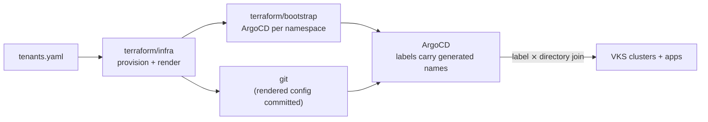

# ArgoCD Scaffolding Project

A **reference architecture** for automating a multi-tenant Kubernetes (VKS)
fleet on **VMware Cloud Foundation**: Terraform provisions tenants (projects,
VPCs, supervisor namespaces) and bootstraps a GitOps control plane; ArgoCD
ApplicationSets then provision clusters and applications declared as plain
kustomize in this repo.

The central problem it solves: VCF Automation generates supervisor-namespace
names **at apply time** (`dev-1` → `dev-1-abcde`), so git can never declare
deployment targets by name. The design keeps generated identity out of git
entirely — logical identity lives in the directory layout, the generated names
are captured as labels on the ArgoCD cluster registrations, and ApplicationSets
join the two at sync time.



**Read next:** [docs/ARCHITECTURE.md](docs/ARCHITECTURE.md) — the full design,
diagrams, and the *pattern vs lab* guide for adapting this to your environment ·
[docs/DECISIONS.md](docs/DECISIONS.md) — why each big choice was made (problem → choice → trade-off) ·
[docs/BACKLOG.md](docs/BACKLOG.md) — known limitations and planned work.

## Getting Started

### Prerequisites

| Tool | Purpose |
|------|---------|
| `terraform` >= 1.9 | Provisions namespaces, renders generated files, bootstraps ArgoCD |
| `kustomize` | Local validation (`make validate`) — same version CI uses |
| `make` | Orchestrates the two-phase Terraform workflow |
| VCF Automation access | `vcfa_url`, `vcfa_org`, and an API refresh token |

### Required Variables

Set these **before** running `make apply`. All sensitive values go via `TF_VAR_*` exports; non-sensitive values can go in `terraform/infra/terraform.tfvars` (gitignored).

**Required for `apply-infra`:**

| Variable | How to set | Description |
|----------|-----------|-------------|
| `vcfa_refresh_token` | `export TF_VAR_vcfa_refresh_token=...` | VCF Automation API token (sensitive) |
| `vcfa_url` | tfvars or `export TF_VAR_vcfa_url=...` | VCF Automation URL (e.g. `https://vcfa.example.com`) |
| `vcfa_org` | tfvars or `export TF_VAR_vcfa_org=...` | VCF Automation org name |
| `region_name` | tfvars or `export TF_VAR_region_name=...` | Region used to name VPCs (`{tenant}-{region}-vpc`) |
| `avi_enabled` | tfvars or `export TF_VAR_avi_enabled=false` | `true` (default) for AVI LB regions; `false` for NSX_LB regions — omits `loadBalancerVPCEndpoint` from VPC spec |

**Required for `apply-bootstrap`** (`namespace_config` is passed automatically by the
Makefile from the infra output; the same vcfa creds as `apply-infra` are needed too —
bootstrap mints its own per-namespace tokens via `data.vcfa_kubeconfig`, so no
kubeconfigs are shuttled between the runs and tokens are always fresh):

| Variable | How to set | Description |
|----------|-----------|-------------|
| `repo_url` | *(usually unset)* | GitOps repo URL for the root ArgoCD Application. Empty (default) reads `argocd/repo-config.yaml` — the same single source the ApplicationSets use — so a fork edits only that file. Set `TF_VAR_repo_url` only to deliberately diverge. |
| `argo_password` | `export TF_VAR_argo_password=...` | ArgoCD admin password (bcrypt hash); optional, defaults to `""` |

**Optional — enable AKO secret:**

| Variable | How to set | Description |
|----------|-----------|-------------|
| `ako_secret_enabled` | tfvars or `export TF_VAR_ako_secret_enabled=true` | Create the AKO secret in each namespace |
| `ako_username` | `export TF_VAR_ako_username=...` | Base64-encoded AVI username |
| `ako_password` | `export TF_VAR_ako_password=...` | Base64-encoded AVI password |
| `ako_ca_data` | `export TF_VAR_ako_ca_data=...` | Base64-encoded Root CA for AVI |

### Backend Configuration

Both Terraform roots (`terraform/infra`, `terraform/bootstrap`) use the **Kubernetes
backend** — state is stored as a `Secret` in a dedicated supervisor namespace, so runs
are portable across machines/CI. The two roots use distinct `secret_suffix` values
(`infra`, `bootstrap`) and share one namespace.

**One-time bootstrap** — point the `vcf` CLI at your vCFA endpoint, then create the
project + state namespace (the supervisor namespace uses `generateName`, so use `create`,
not `apply`, and capture the generated name):
```sh
vcf context use <vcfa-context>   # sets the kube context; no --kubeconfig needed below
kubectl apply -f terraform/state-namespace/project.yaml
NAME=$(kubectl create -f terraform/state-namespace/state-namespace.yaml -o jsonpath='{.metadata.name}')
echo "namespace = \"$NAME\"" > terraform/state-backend/namespace.auto.tfvars   # commit this
```

**How init works** — `make init-infra` / `init-bootstrap` first run `make state-backend`
(the stateless `terraform/state-backend` helper), which pulls fresh namespace creds and
renders two gitignored files: `.kube-backend.config` (a kubeconfig with the server + token)
and `.kube-backend.env` (`KUBE_NAMESPACE`, sourced into every recipe). Each root's
`backend.tf` hardcodes `config_path = "../../.kube-backend.config"` (relative to the root dir
under `-chdir`, i.e. the repo root), `insecure = true`, and a `secret_suffix` literal. The
kubernetes backend reads host + token from the kubeconfig but does **not** take the target
namespace from it, so that one value is supplied via `KUBE_NAMESPACE`. Credentials never land
in `-backend-config`, `.terraform`, or plan files. (A kubeconfig at `config_path` is what
`terraform init` reliably honors for auth; the individual `KUBE_HOST`/`KUBE_TOKEN` did not
work.) The helper re-reads the kubeconfig live each run, so the token is never stale.
`make state-backend` needs the same vcfa `TF_VAR_*` as `apply-infra`.

### First-time Setup

1. Clone this repo and `cd` into it.
2. `cp .env.example .env` and fill in the values (vcfa creds + bootstrap secrets). The
   Makefile auto-loads and exports `.env` to every terraform root, including the
   `state-backend` helper — prefer this over per-root `terraform.tfvars`, which the
   `state-backend` dir doesn't see (and would prompt for vcfa vars).
3. **Bootstrap the Terraform state namespace** (one-time) — follow
   [Backend Configuration](#backend-configuration): `vcf context use`, create the project +
   state namespace, write the generated name into
   `terraform/state-backend/namespace.auto.tfvars`, and commit it. Required before any
   `make apply-*`, since `init` stores state in that namespace.
4. Edit `terraform/infra/tenants.yaml` — add your infra tenant and at least one namespace with `deploy_argo: true`.
5. Update `argocd/repo-config.yaml` with your GitOps repo URL.
6. Run:
   ```sh
   make apply-infra
   ```
   `init` auto-runs `make state-backend` (renders `.kube-backend.config` + `.kube-backend.env`) and uses the Kubernetes
   backend. This provisions namespaces and renders generated files (`argocd/projects/`,
   `infrastructure/clusters/*/vars/`, `terraform/bootstrap/{providers,main}.tf`).
7. Commit the rendered files.
8. Run:
   ```sh
   make apply-bootstrap
   ```
   This deploys the ArgoCD Helm chart and root Application into each namespace with `deploy_argo: true`.
9. Verify with `make validate` — build-tests every Kustomize entrypoint.

---

## Overview

> The full architecture — with diagrams, the decision model, and the seams
> guide for swapping lab-specific pieces — is in
> [docs/ARCHITECTURE.md](docs/ARCHITECTURE.md).

The project follows a **GitOps** workflow where the entire state of the infrastructure and applications is defined in this repository. There are two distinct lifecycles:

- **Tenant management** — driven by `terraform/infra/tenants.yaml` and Terraform. Provisions supervisor namespaces, quotas, bootstraps the ArgoCD instance, and renders all generated config (ArgoCD projects, tenant vars, bootstrap wiring).
- **Cluster management** — driven by GitOps. Hand-authored cluster directories under `infrastructure/clusters/{project}/{namespace_ref}/{cluster}/` are auto-discovered by ArgoCD ApplicationSets via a label-based decision model.

### Key Technologies

- **Terraform**: Provisions vSphere supervisor namespaces, bootstraps ArgoCD via Helm, and renders all generated config from `tenants.yaml` via `local_file`/`templatefile` (no Python, no ytt).
- **Helm**: Used by Terraform to deploy the `bootstrap-tenant` chart (ArgoCD instance + root app).
- **ArgoCD**: GitOps engine managing the lifecycle of clusters and applications via the App of Apps pattern.
- **Kustomize**: Structures Kubernetes manifests using Base/Components/Profiles with variable injection. Clusters inherit an environment **profile** and add only their own deltas, so fleet-wide changes happen in one place while per-cluster overrides stay easy.
- **GitHub Actions**: CI/CD for running `make apply` on tenant changes (which also renders + commits generated files).
- **AKO (Avi Kubernetes Operator)**: Configured as an infrastructure addon for load balancing.

## Directory Structure

- `terraform/`
  - `infra/`: Provisions vSphere supervisor namespaces and renders all generated config from `tenants.yaml` (`generate.tf` + `templates/*.tftpl`). Outputs `namespace_config` (suffixed namespace names + decision-model labels) for the bootstrap run.
  - `bootstrap/`: Deploys the `bootstrap-tenant` Helm chart into each namespace. `providers.tf`/`main.tf` are rendered by the infra run; `locals.tf` (hand-authored) merges secrets into the infra run's `namespace_config` output (which carries the suffixed namespace names + `gitops.platform/*` labels). `vcfa.tf` mints a fresh per-namespace token for each helm provider on every run.
  - `state-namespace/`: Committed `Project` + `SupervisorNamespace` manifests for the Terraform state backend, applied once out-of-band (see [Backend Configuration](#backend-configuration)).
  - `state-backend/`: Stateless helper that pulls the state-namespace creds and renders the gitignored `.kube-backend.config` kubeconfig (host + token; each `backend.tf` sets `config_path` to it) and `.kube-backend.env` (`KUBE_NAMESPACE`, sourced by the Makefile) for the infra/bootstrap Kubernetes backends. `namespace.auto.tfvars` holds the captured namespace name.
  - `modules/bootstrap-helm/`: Terraform module wrapping the bootstrap Helm chart (single `config` object input).
  - `modules/tenant/`, `modules/svns/`, `modules/vpc/`: vSphere infrastructure modules.
- `charts/bootstrap-tenant/`: Helm chart that deploys the `ArgoNamespace` registration, ArgoCD instance + root Application.
- `argocd/`
  - `appsets/`: ApplicationSets that discover and deploy clusters and apps (label-based join).
  - `projects/`: ArgoCD AppProject definitions, all rendered by the infra run (the `infra`-type tenant's project is rendered as `infra.yaml`, the project the ApplicationSets target).
  - `repo-config.yaml`: Single source of truth for the GitOps repo URL.
- `infrastructure/`
  - `base/`: Reusable base Kustomize configs (e.g., `ako`, `antrea`, `vks-cluster`). Bases carry `replace-me` placeholders for environment values.
  - `components/`: Kustomize components for optional features and environment overlays. `envs/{env}` carries the real per-environment values AND the always-on version pins (cluster class, Kubernetes version, AKO addon); feature-scoped sub-components (`envs/{env}/istio`) pin optional features' versions and are included by the cluster alongside the feature.
  - `profiles/{env}/`: The inherited default set for an environment — bases + always-on components + the env overlay. Clusters reference a profile instead of enumerating everything.
  - `clusters/{project}/{namespace_ref}/{cluster}/`: Per-cluster definitions (`kustomization.yaml`, `apps/kustomization.yaml`, `cluster-details.yaml`). Each references a profile and adds only deltas + override patches. `clusters/{project}/vars/` holds the Terraform-rendered `tenant-vars.yaml`.
- `apps/`
  - `base/`: Base application manifests.
  - `components/stacks/`: Application stacks (e.g., `standard`, `observability`).
  - `components/envs/{env}/`: Per-environment app values and version pins — the baseline (package-repo bundle, cert-manager version) is applied via the profile; feature-scoped sub-components (`envs/{env}/observability`) pin optional stacks' versions and are included by the cluster alongside the stack.
  - `profiles/{env}/`: The inherited default app stack for an environment.
- `docs/examples/`
  - `cluster-template/`: Copy-me template for onboarding a new cluster.
  - `sample-tenant-repo/`: Example of what a tenant keeps in their **own** app repo (not deployed by this platform).
- `.github/workflows/`
  - `apply.yml`: On pushes to `main` touching `terraform/**` or `charts/bootstrap-tenant/**`, runs `make apply-infra` (provisions + renders generated files), commits them (`git add -A`, so deletions of removed tenants are staged too), then runs `make apply-bootstrap`. Applies run with `TF_APPLY_FLAGS=-auto-approve -input=false` (no TTY in Actions).
  - `validate.yml`: On PRs and pushes to `main`, runs `scripts/validate.sh` (see [Local Testing](#local-testing)) plus a terraform job (`fmt -check` and `validate` with `-backend=false` for each root).

## Local Testing

Before pushing, build-test every kustomize entrypoint the same way CI does:

```sh
make validate        # or: ./scripts/validate.sh
```

It renders the argocd root and every cluster (infra + `apps/`) with kustomize and checks:

- each `cluster-details.yaml` matches its directory path;
- no rendered output contains `replace-me` (i.e. no cluster skipped its
  `components/envs/{env}` overlay);
- cluster names are globally unique (ArgoCD registrations and the
  `{{.name}}-apps` Applications are keyed by bare cluster name);
- an `apps/` dir that declares a `vars` cluster_name (for the apps-side
  injector) declares the directory's cluster name;
- `docs/examples/cluster-template` still builds (via a temp copy at real depth).

Requires `kustomize` on your PATH.

### Running the GitHub Actions workflows locally with `act`

You can run the workflows in `.github/workflows/` locally with
[`act`](https://github.com/nektos/act) (requires Docker). Repo defaults live in
`.actrc` (pins the `catthehacker/ubuntu:act-latest` runner image).

```sh
# validate.yml — safe, no secrets (mirrors `make validate`)
act pull_request -W .github/workflows/validate.yml

# apply.yml — runs real terraform apply against live infrastructure
act push -W .github/workflows/apply.yml --secret-file .secrets
```

`apply.yml` needs the same secrets CI uses — copy them into `.secrets` (gitignored;
see the placeholders in that file). State now lives in the Kubernetes backend, so the
state-namespace must already exist and `terraform/state-backend/namespace.auto.tfvars`
must hold its name (see **Backend Configuration**); the workflow's `state-backend` step
fetches the kubeconfig at run time from the vcfa creds. Optionally set `GITHUB_TOKEN` in
`.secrets` to let the workflow's `git push` step push regenerated files. **`act push` on
`apply.yml` mutates live infrastructure.**

## Tenant Types

- **`type: infra`** — The platform tenant that hosts the ArgoCD instance. Generates an unrestricted ArgoCD project (`namespaceResourceWhitelist: */*`). Only one infra tenant is supported, but it may have multiple namespaces each with `deploy_argo: true`. The `infra` project owns all cluster provisioning (ApplicationSets use `project: infra`).
- **`type: tenant`** — Developer tenants. Each gets a dedicated ArgoCD project for deploying apps into their clusters. The generated project denies the in-cluster and supervisor-namespace destinations, whitelists only `Namespace` as a cluster-scoped kind (for `CreateNamespace=true`), and allows all namespaced kinds. `sourceRepos` defaults open (tenant repos aren't known at render time) — scope it per tenant with `source_repos: [...]` in `tenants.yaml`. Note: tenants are **not** isolated from each other's workload clusters (cluster names carry no tenant prefix to match on; see `docs/BACKLOG.md`).

## Workflows

### 1. Bootstrapping a New Tenant

1. Add a new entry to `terraform/infra/tenants.yaml`. Required per-namespace fields:
   - `environment` — selects the Kustomize profile (`dev`, `prod`, …)
   - `zone_name` — vSphere zone for the namespace (a default of `z-wld-a` exists but **always set this explicitly** — zone names vary per region)
2. Run `make apply` (or push to `main` — the Apply workflow runs it). `apply-infra`:
   - provisions the supervisor namespace(s), and
   - renders `argocd/projects/{tenant}.yaml`, the projects kustomization,
     `infrastructure/clusters/{tenant}/vars/{tenant-vars,kustomization}.yaml`
     (with the auto-generated `tenant_uuid`, `vpc_name`, `nsxt_t1_path`,
     `argo_namespace`), and `terraform/bootstrap/{providers,main}.tf`.
3. Commit those generated files; then bootstrap deploys the Helm chart and ArgoCD.
   (`make apply-bootstrap` refuses to run while rendered files are uncommitted —
   ArgoCD reads git, so bootstrapping ahead of the commit would hand it stale
   config. Override with `SKIP_GENERATED_CHECK=1` if you know what you're doing.)
   The root Application auto-syncs (prune + selfHeal), so later commits to
   `argocd/` reconcile without a manual sync — set `rootApp.autoSync: false` in
   the chart values to gate that by hand.

### 2. Provisioning a New Cluster

1. Copy the template into place:
   ```sh
   cp -r docs/examples/cluster-template \
     infrastructure/clusters/{project}/{namespace_ref}/{cluster}
   ```
2. Edit `cluster-details.yaml` so `cluster_name`, `project`, and `namespace_ref`
   match the directory path (`namespace_ref` matches a namespace `name` in
   `tenants.yaml` and must be unique per project). The `validate.yml` workflow
   enforces this match on every PR.
3. Set the environment by referencing the right profile (`profiles/{env}`) in
   both `kustomization.yaml` and `apps/kustomization.yaml`. Add only the optional
   feature components / app stacks this cluster needs, and any override patches —
   everything else is inherited from the profile. An optional feature travels
   with its `envs/{env}` sub-component (e.g. `istio` + `ako-istio` +
   `envs/dev/istio`; `stacks/observability` + `envs/dev/observability`) — the
   sub-component pins the feature's version for the environment, and forgetting
   it fails validation (`replace-me` in rendered output). Keep
   `cluster-var-injector` **last** in the infra component list.
4. Commit. The `cluster-provisioning` ApplicationSet joins the directory to its
   supervisor namespace by label (`gitops.platform/project` +
   `gitops.platform/namespace-ref`) and provisions it. The vcfa-generated
   namespace name is resolved from the cluster registration, not from git.

### 3. Deploying Applications

1. Define app bases in `apps/base/`.
2. Group apps into stacks in `apps/components/stacks/`.
3. Enable stacks for a cluster by editing its `apps/kustomization.yaml`.
4. ArgoCD syncs the `cluster-apps` ApplicationSet and deploys the assigned apps.

## Inheritance model (profiles, components, overrides)

A cluster does not enumerate its whole stack. It references an environment
**profile** and layers deltas on top:

- **Profile** (`infrastructure/profiles/{env}`, `apps/profiles/{env}`): the
  always-on set for an environment — bases + always-on feature components + the
  env overlay that carries the real per-environment values. Change something for
  every cluster in an environment by editing the profile once.
- **Deltas**: a cluster adds optional feature components (`istio`, `ako-istio`,
  `cluster-autoscaling`, …) and app stacks (`observability`) that aren't part of
  the baseline.
- **Overrides**: anything inherited can be overridden per-cluster with a
  `patches:` block in the cluster `kustomization.yaml` (escape hatch).

Because everything resolves through plain Kustomize, `kustomize build <cluster-dir>`
reproduces exactly what ArgoCD deploys — env selection is an explicit profile
reference, never injected at sync time.

### Version management (staged rollouts)

No version is pinned in a shared base — bases carry `replace-me` placeholders and
`validate.sh` rejects any rendered output still containing one, so a missed overlay
fails at PR time instead of deploying a placeholder. Versions live in three layers:

| Layer | What it pins | Where |
|-------|--------------|-------|
| Env (always-on) | cluster class, Kubernetes version, AKO addon; package bundle + baseline packages | `infrastructure/components/envs/{env}`, `apps/components/envs/{env}` (applied via the profiles) |
| Env (optional feature) | istio addon; observability packages | `infrastructure/components/envs/{env}/istio`, `apps/components/envs/{env}/observability` — the cluster includes these alongside the feature/stack |
| Per-cluster override | anything, e.g. a canary Kubernetes version | `patches:` block in the cluster `kustomization.yaml` (applies after all components) |

To roll a version: bump it in `envs/dev`, let dev soak, then mirror the change in
`envs/prod`. To canary one cluster first, add a `patches:` override to just that
cluster and remove it once the env-wide pin catches up.

## AKO Configuration

AKO is configured as a modular Kustomize component.

- **Base**: `infrastructure/base/ako` defines `AddonConfig` and `AddonInstall` with `replace-me` placeholders for environment values.
- **Variable injection**: `cluster-var-injector` injects `cluster_name`/`project` (from `cluster-details.yaml`) and `tenant_uuid`/`nsxt_t1_path`/`argo_namespace` (from `tenant-vars.yaml`). It must run **last** so it rewrites resources pulled in by the profile and the feature components. The apps tree has its own smaller injector (`apps/components/cluster-var-injector`) fed by a per-cluster `vars` configMapGenerator (kustomize load restrictions keep `apps/` from reading `../cluster-details.yaml`); it makes `apps/base/istio-ako-patch` reusable across clusters.
- **Environment overlays**: `infrastructure/components/envs/{env}` owns the real `controllerHost`/`cloudName` values and is applied via the profile, so a cluster that skips it fails loudly instead of running on stale defaults.
- **Istio integration**: `infrastructure/components/ako-istio` enables Istio support (include `istio` + `ako-istio` in the cluster `kustomization.yaml`).

## Label-based provisioning (decision model)

Each supervisor namespace registers to ArgoCD with `clusterLabels` (computed in
`terraform/infra/main.tf` and passed to the bootstrap run via the
`namespace_config` output):

| Label | Source | Role |
|-------|--------|------|
| `type: supervisor-ns` | computed | coarse selector |
| `gitops.platform/project` | tenant name | join key (== top dir) |
| `gitops.platform/namespace-ref` | namespace name | join key (== 2nd dir); unique per project |
| `gitops.platform/environment` | namespace `environment` | decision dimension |
| `gitops.platform/namespace` | vcfa-suffixed name, captured by the chart | supplies `destination.namespace` |

A cluster directory `infrastructure/clusters/{project}/{namespace_ref}/{cluster}/`
is provisioned into the supervisor namespace whose labels match its
`(project, namespace_ref)`. The `cluster-provisioning` ApplicationSet templates the
git path with those label values, so the match is exact and collision-free. The
workload `ArgoCluster` registrations carry the same join keys (plus
`type: tenant`), so `cluster-apps` joins exactly too.

## Auto-Generated Values

Some values are only known after Terraform runs and are rendered by the infra run
into `infrastructure/clusters/{tenant}/vars/tenant-vars.yaml`:

| Value | Source |
|-------|--------|
| `tenant_uuid` | K8s UID of the vSphere Project CRD |
| `vpc_name` | the vpc module's output (`{tenant}-{region}-vpc`) |
| `nsxt_t1_path` | full NSX T1 path (`/orgs/default/projects/{uuid}/vpcs/{vpc}`), consumed verbatim by AKO's `nsxtT1LR` |
| `argo_namespace` | vSphere-generated infra namespace ID |

The supervisor namespace's own suffixed name is **not** written to git — it is carried
as the `gitops.platform/namespace` cluster label and consumed at sync time.

## Repo URL Configuration

The GitOps repo URL is defined in one place: `argocd/repo-config.yaml`. Kustomize replacements inject it into all ApplicationSets at apply time. When forking or moving this repo, update only that file.

The bootstrap run reads the same file for the root ArgoCD Application's `repoURL`
(`terraform/bootstrap/locals.tf` yamldecodes it), so no second edit is needed when
forking. `TF_VAR_repo_url` exists only as a deliberate override.
