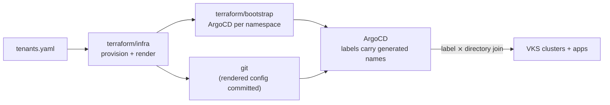

# ArgoCD Scaffolding Project

A **reference architecture** for automating a multi-tenant Kubernetes (VKS)
fleet on **VMware Cloud Foundation**: Terraform provisions tenants (projects,
VPCs, supervisor namespaces) and bootstraps a GitOps control plane; ArgoCD
ApplicationSets then provision clusters and applications declared as plain
kustomize in this repo.




**Read next:** [docs/ARCHITECTURE.md](docs/ARCHITECTURE.md) — the full design,
diagrams, and the *pattern vs lab* guide for adapting this to your environment ·
[docs/DECISIONS.md](docs/DECISIONS.md) — why each big choice was made (problem → choice → trade-off) ·
[docs/BACKLOG.md](docs/BACKLOG.md) — known limitations and planned work.

## Getting Started

**Follow [docs/GETTING-STARTED.md](docs/GETTING-STARTED.md)** — the complete
zero-to-app walkthrough (fresh VCF org → state backend → tenants → ArgoCD →
first cluster → a tenant app running). It covers the prerequisites (Part 0),
every command, and the expected output at each step.

The short version, for orientation:

1. Fork; set your repo URL in `argocd/repo-config.yaml`.
2. One-time: create the Terraform state namespace and capture its generated
   name ([Part 1.1](docs/GETTING-STARTED.md#11-state-backend-10-min)
   of the walkthrough).
3. Optional, needs Supervisor-admin **and** a fleet on 3.7: register a custom
   helm chart repo
   ([Part 1.2](docs/GETTING-STARTED.md#12-custom-vks-addon-repositories-5-min-once-per-addon)).
   external-secrets ships commented out — read the warnings there first.
4. `cp .env.example .env`, fill in the vcfa creds + bootstrap secrets — the
   Makefile loads it into every terraform root.
5. Declare tenants in `terraform/infra/tenants.yaml` (one `type: infra`
   tenant with a `deploy_argo: true` namespace).
6. `make apply-infra` → commit the rendered files → `make apply-bootstrap`.
7. Add clusters by copying `docs/examples/cluster-template` and pushing —
   ArgoCD picks them up by label join. `make validate` before every push.

## Configuration Reference

Everything in this section is **reference**, not a setup sequence — the
walkthrough above says when each piece comes into play. Consult it when you
need the full variable list or want to understand how Terraform state and
backend credentials work.

### Required Variables

Variables read by `make apply` (both Terraform roots). Sensitive values go
via `TF_VAR_*` exports — in practice via `.env` (copied from `.env.example`),
which the Makefile loads into every Terraform run. Non-sensitive values can
alternatively go in `terraform/infra/terraform.tfvars` (gitignored).

**Required for `apply-infra`:**

| Variable | How to set | Description |
|----------|-----------|-------------|
| `vcfa_refresh_token` | `export TF_VAR_vcfa_refresh_token=...` | VCF Automation API token (sensitive) |
| `vcfa_url` | tfvars or `export TF_VAR_vcfa_url=...` | VCF Automation URL (e.g. `https://vcfa.example.com`) |
| `vcfa_org` | tfvars or `export TF_VAR_vcfa_org=...` | VCF Automation org name |
| `region_name` | tfvars or `export TF_VAR_region_name=...` | Region used to name VPCs (`{tenant}-{region}-vpc`) |
| `avi_enabled` | tfvars or `export TF_VAR_avi_enabled=true` | `true` for AVI/NSX-ALB LB regions (adds `loadBalancerVPCEndpoint` to the VPC spec + AKO addon); `false` (default) for NSX_LB regions — VPC gets an NSX `LoadBalancer` CR instead. Must match your region. |
| `seg_name` | tfvars or `export TF_VAR_seg_name=...` | Service Engine Group applied to each supervisor namespace. **Required when `avi_enabled=true`**; leave unset (`null` default) for NSX_LB regions. |

**Required for `apply-bootstrap`** (`namespace_config` is passed automatically by the
Makefile from the infra output; the same vcfa creds as `apply-infra` are needed too —
bootstrap mints its own per-namespace tokens via `data.vcfa_kubeconfig`, so no
kubeconfigs are shuttled between the runs and tokens are always fresh):

| Variable | How to set | Description |
|----------|-----------|-------------|
| `repo_url` | *(usually unset)* | GitOps repo URL for the root ArgoCD Application. Empty (default) reads `argocd/repo-config.yaml` — the same single source the ApplicationSets use — so a fork edits only that file. Set `TF_VAR_repo_url` only to deliberately diverge. |
| `argo_password` | `export TF_VAR_argo_password=...` | ArgoCD admin password (bcrypt hash); optional, defaults to `""` |

### Backend Configuration

Both Terraform roots (`terraform/infra`, `terraform/bootstrap`) use the **Kubernetes
backend** — state is stored as a `Secret` in a dedicated supervisor namespace, so runs
are portable across machines/CI. The two roots use distinct `secret_suffix` values
(`infra`, `bootstrap`) and share one namespace.

**One-time setup** — the state namespace is created once, by hand, from the
committed manifests in `terraform/state-namespace/` (the `vcf` CLI points
`kubectl` at your vCFA endpoint), and its generated name is captured in
`terraform/state-backend/namespace.auto.tfvars` (committed). The exact
commands — and why it's `kubectl create`, not `apply` — are in
[Part 1.1 of the walkthrough](docs/GETTING-STARTED.md#11-state-backend-10-min).

**How init works** — `make init-infra` / `init-bootstrap` first run `make state-backend`
(the stateless `terraform/state-backend` helper), which pulls fresh namespace creds and
renders two gitignored files: `.kube-backend.config` (a kubeconfig with the server + token)
and `.kube-backend.env` (`KUBE_NAMESPACE`, sourced into every recipe). Each root's
`backend.tf` hardcodes `config_path = "../../.kube-backend.config"` (relative to the root dir
under `-chdir`, i.e. the repo root), `insecure = true`, and a `secret_suffix` literal. The
kubernetes backend reads host + token from the kubeconfig but does **not** take the target
namespace from it, so that one value is supplied via `KUBE_NAMESPACE`. Credentials never land
in `-backend-config`, `.terraform`, or plan files. (A kubeconfig at `config_path` is what
`terraform init` reliably honors for auth; the individual `KUBE_HOST`/`KUBE_TOKEN` did not
work.) The helper re-reads the kubeconfig live each run, so the token is never stale.
`make state-backend` needs the same vcfa `TF_VAR_*` as `apply-infra`.

### Troubleshooting: state surgery and teardown

**Running raw `terraform` fails to authenticate.** The Kubernetes backend needs
a fresh token in `.kube-backend.config` plus `KUBE_NAMESPACE` — both supplied by
the Makefile, not your shell. So a bare `terraform state list` in a root dir
errors on auth. Use `make shell` to drop into a subshell primed for a root
(fresh creds, `-reconfigure` init, `cd`'d in, and — for bootstrap —
`TF_VAR_namespace_config` exported from the infra output):

```sh
make shell ROOT=bootstrap        # or ROOT=infra
# then run terraform directly, with your shell's own quoting:
terraform state list
terraform state rm 'module.tenant["tenant-1"].module.svns["dev-1"].vcfa_supervisor_namespace.supervisor_namespace'
exit
```

Quote bracketed addresses (`module.tenant["tenant-1"]`) as you would in any
shell — because you're in a real shell, not passing the address through `make`,
there's no extra quote-stripping layer (that layer is what produces terraform's
`Index value required` error).

**Teardown order (`make destroy`).** `make destroy` runs three steps in order:
`destroy-apps` → `destroy-bootstrap` → `destroy-infra`. The first step exists
because the `*-provision` / `*-apps` Applications are generated by the
ApplicationSet controllers at runtime, not owned by the bootstrap helm release —
so destroying bootstrap alone would tear ArgoCD down before those Applications
finalize, orphaning them and **leaking the VKS workload clusters** (whose
deletion is driven by the Applications' finalizers). `destroy-apps` first quiesces
the helm-owned root app (removes its automated `syncPolicy` so it stops
selfHeal-recreating the ApplicationSets and pruning the AppProjects mid-teardown,
and strips its finalizer) but leaves the object for `destroy-bootstrap`/helm to
delete — keeping the AppProjects alive while the workload Applications delete
avoids an "app is not allowed in project" finalizer deadlock. It then deletes the
ApplicationSets/Applications and waits for the finalizer cascade *while ArgoCD is
still up*. It talks to the vcfa supervisor via a throwaway kubeconfig built from
bootstrap's `argo_endpoints` output (`terraform/bootstrap/cleanup.tf`, an output
only — nothing is written during a normal apply) — no ambient `kubectl` context
required; the step runs a refresh-only pass first (`plan -refresh-only -out` +
`apply <planfile>`, so the still-set `TF_VAR_namespace_config` doesn't trip
Terraform's saved-plan variable guard) so the short-lived tokens are current.
Requires `kubectl` + `jq`. You can run it alone (e.g. to drain a lab before
rebuilding): `make destroy-apps`.

**`make destroy` fails at `destroy-bootstrap` with `namespace_config` empty/
missing.** Bootstrap destroy reads infra's `namespace_config` output to auth its
per-namespace providers. If infra was never fully applied (a partial
`apply-infra` writes no outputs) or is already destroyed, that output is gone and
bootstrap can't be destroyed through the Makefile. Recover by:

- If nothing was actually bootstrapped, skip it: `make destroy-infra`.
- If infra is only partially applied, finish it first (`make apply-infra`), then
  `make destroy`.
- If bootstrap state is orphaned, clear it by hand: `make shell ROOT=bootstrap`
  then `terraform state list` / `terraform state rm '<address>'`.

**Deletion is live.** Removing or renaming a cluster directory deletes the real
cluster (a rename is delete + recreate to ArgoCD). Likewise, committing the
deletion of the `apply-infra`-rendered files (`argocd/projects/`,
`infrastructure/clusters/*/vars/`, `terraform/bootstrap/{main,providers}.tf`)
makes ArgoCD prune the corresponding AppProjects. If you deleted them by
accident, restore before syncing:

```sh
git checkout -- argocd/projects infrastructure/clusters/*/vars \
  terraform/bootstrap/main.tf terraform/bootstrap/providers.tf
```

---

## Overview

> The full architecture — with diagrams, the decision model, and the seams
> guide for swapping lab-specific pieces — is in
> [docs/ARCHITECTURE.md](docs/ARCHITECTURE.md).

The project follows a **GitOps** workflow where the entire state of the infrastructure and applications is defined in this repository. There are two distinct lifecycles:

- **Tenant management** — driven by `terraform/infra/tenants.yaml` and Terraform. Provisions supervisor namespaces, quotas, bootstraps the ArgoCD instance, and renders all generated config (ArgoCD projects, tenant vars, bootstrap wiring).
- **Cluster management** — driven by GitOps. Hand-authored cluster directories under `infrastructure/clusters/{project}/{namespace_ref}/{cluster}/` are auto-discovered by ArgoCD ApplicationSets via a label-based decision model.

### Key Technologies

- **Terraform**: Provisions vSphere supervisor namespaces, bootstraps ArgoCD via Helm, and renders all generated config from `tenants.yaml` via `local_file`/`templatefile` (no Python, no ytt).
- **Helm**: Used by Terraform to deploy the `bootstrap-tenant` chart (ArgoCD instance + root app).
- **ArgoCD**: GitOps engine managing the lifecycle of clusters and applications via the App of Apps pattern.
- **Kustomize**: Structures Kubernetes manifests using Base/Components/Profiles with variable injection. Clusters inherit an environment **profile** and add only their own deltas, so fleet-wide changes happen in one place while per-cluster overrides stay easy.
- **GitHub Actions**: CI/CD for running `make apply` on tenant changes (which also renders + commits generated files).
- **AKO (Avi Kubernetes Operator)**: Configured as an infrastructure addon for load balancing.

## Directory Structure

- `terraform/`
  - `infra/`: Provisions vSphere supervisor namespaces and renders all generated config from `tenants.yaml` (`generate.tf` + `templates/*.tftpl`). Outputs `namespace_config` (suffixed namespace names + decision-model labels) for the bootstrap run.
  - `bootstrap/`: Deploys the `bootstrap-tenant` Helm chart into each namespace. `providers.tf`/`main.tf` are rendered by the infra run; `locals.tf` (hand-authored) merges secrets into the infra run's `namespace_config` output (which carries the suffixed namespace names + `gitops.platform/*` labels). `vcfa.tf` mints a fresh per-namespace token for each helm provider on every run.
  - `state-namespace/`: Committed `Project` + `SupervisorNamespace` manifests for the Terraform state backend, applied once out-of-band (see [Backend Configuration](#backend-configuration)).
  - `state-backend/`: Stateless helper that pulls the state-namespace creds and renders the gitignored `.kube-backend.config` kubeconfig (host + token; each `backend.tf` sets `config_path` to it) and `.kube-backend.env` (`KUBE_NAMESPACE`, sourced by the Makefile) for the infra/bootstrap Kubernetes backends. `namespace.auto.tfvars` holds the captured namespace name.
  - `modules/bootstrap-helm/`: Terraform module wrapping the bootstrap Helm chart (single `config` object input).
  - `modules/tenant/`, `modules/svns/`, `modules/vpc/`: vSphere infrastructure modules.
  - `modules/cluster-policy/`, `modules/cluster-policy-template/`: Vendored (split) from [warroyo/vcfa-terraform-examples](https://github.com/warroyo/vcfa-terraform-examples/tree/main/cluster-policy-custom) — the `ClusterPolicy`/`ClusterPolicyTemplate` mechanics behind the custom cluster policy catalog. See [Cluster Policy & Namespace Self-Service](#cluster-policy--namespace-self-service).
  - `infra/policies.tf`, `infra/rego/*.rego`: The custom cluster policy catalog, driven by each tenant's `policies:` block in `tenants.yaml`.
- `supervisor-addons/`: Hand-authored, **not** Terraform-managed, **not** GitOps-synced. `AddonRepository`/`AddonRepositoryInstall` manifests registering a custom helm chart repo (e.g. `external-secrets`) as an installable VKS addon in `vmware-system-vks-public` — a genuine Supervisor-scope namespace this repo's Terraform and ArgoCD credentials can't reach. Applied manually with `kubectl` by a human holding Supervisor-admin access; see [Getting Started](docs/GETTING-STARTED.md) Part 1.2.
- `charts/bootstrap-tenant/`: Helm chart that deploys the `ArgoNamespace` registration, ArgoCD instance + root Application.
- `argocd/`
  - `appsets/`: ApplicationSets that discover and deploy clusters and apps (label-based join): `cluster-provisioning` (per cluster dir), `cluster-apps` (per cluster `apps/` dir), and `namespace-resources` (one app per supervisor namespace, sourced from `infrastructure/clusters/{project}/{namespace_ref}/namespace-resources/` — for namespace-scoped shared resources like label-gated add-on installs).
  - `projects/`: ArgoCD AppProject definitions, all rendered by the infra run (the `infra`-type tenant's project is rendered as `infra.yaml`, the project the ApplicationSets target).
  - `config/`: Server-Side-Apply patch enabling ArgoCD sync impersonation (`argocd-cm-patch.yaml` — owns one `argocd-cm` key, coexisting with the argocd-service operator's own management of the rest).
  - `repo-config.yaml`: Single source of truth for the GitOps repo URL.
- `infrastructure/`
  - `base/`: Reusable base Kustomize configs (e.g., `ako`, `antrea`, `vks-cluster`, `headlamp`, `istio`, `istio-config`, `external-secrets`). Bases carry `replace-me` placeholders for environment values.
  - `components/`: Kustomize components for optional features and environment overlays. `envs/{env}` carries the real per-environment values AND the always-on version pins (cluster class, Kubernetes version, AKO addon); feature-scoped sub-components (`envs/{env}/istio`, `envs/{env}/headlamp`) pin shared add-on versions and are included by the namespace's `namespace-resources` kustomization alongside the add-on base. `addon-bundles/{bundle}` adds the bundle label (`addons.kubernetes.vmware.com/profile: standard` — istio + external-secrets + observability) that a whole set of `AddonInstall`s selects on; per-add-on components override it in either direction (`istio` / `disable-istio`, `disable-external-secrets`, `disable-observability`, `disable-headlamp`); `istio-config` opts a cluster into per-cluster istio value overrides.
  - `profiles/{env}/`: The inherited default set for an environment — bases + always-on components + the env overlay. Clusters reference a profile instead of enumerating everything.
  - `clusters/{project}/{namespace_ref}/{cluster}/`: Per-cluster definitions (`kustomization.yaml`, `apps/kustomization.yaml`, `cluster-details.yaml`). Each references a profile and adds only deltas + override patches. `clusters/{project}/vars/` holds the Terraform-rendered `tenant-vars.yaml`. `clusters/{project}/{namespace_ref}/namespace-resources/` (optional) holds namespace-scoped shared resources synced once per supervisor namespace by the `namespace-resources` ApplicationSet — the shared, label-gated `AddonInstall`s (headlamp, istio, external-secrets) and their env version pins.
- `apps/`
  - `base/`: Base application manifests, incl. `tenant-sync` — the per-tenant ArgoCD sync-impersonation `ServiceAccount`/RBAC (see [Cluster Policy & Namespace Self-Service](#cluster-policy--namespace-self-service)), named per-cluster by the apps-side `cluster-var-injector`.
  - `components/stacks/`: Application stacks (e.g., `standard`, which includes `tenant-sync` — shipped to every cluster).
  - `components/envs/{env}/`: Per-environment app values and version pins — the baseline (package-repo bundle, cert-manager version) is applied via the profile. (Observability is no longer an app stack; VKS 9.1+ delivers it via the `automated-monitoring` addon label, set by the standard add-on bundle — opt out per-cluster with `infrastructure/components/disable-observability`.)
  - `profiles/{env}/`: The inherited default app stack for an environment.
- `docs/examples/`
  - `cluster-template/`: Copy-me template for onboarding a new cluster.
  - `sample-tenant-repo/`: Example of what a tenant keeps in their **own** app repo (not deployed by this platform).
- `.github/workflows/`
  - `apply.yml`: On pushes to `main` touching `terraform/**` or `charts/bootstrap-tenant/**`, runs `make apply-infra` (provisions + renders generated files), commits them (`git add -A`, so deletions of removed tenants are staged too), then runs `make apply-bootstrap`. `apply-infra` runs with `TF_APPLY_FLAGS=-auto-approve -input=false`; `apply-bootstrap` (which plans to a file then applies it) skips its manual confirm gate via `AUTO_APPROVE=1` (no TTY in Actions).
  - `validate.yml`: On PRs and pushes to `main`, runs `scripts/validate.sh` (see [Local Testing](#local-testing)) plus a terraform job (`fmt -check` and `validate` with `-backend=false` for each root).

## Local Testing

Before pushing, build-test every kustomize entrypoint the same way CI does:

```sh
make validate        # or: ./scripts/validate.sh
```

It renders the argocd root and every cluster (infra + `apps/`) with kustomize and checks:

- each `cluster-details.yaml` matches its directory path;
- no rendered output contains `replace-me` (i.e. no cluster skipped its
  `components/envs/{env}` overlay);
- an `apps/` dir that declares a `vars` cluster_name/project (for the apps-side
  injector) declares the directory's cluster name and tenant;
- `docs/examples/cluster-template` still builds (via a temp copy at real depth).

Requires `kustomize` on your PATH. If `opa` is also on PATH, it additionally
`opa check`s the custom cluster policy catalog (`terraform/infra/rego/`) —
skipped cleanly if `opa` is absent.

### Running the GitHub Actions workflows locally with `act`

You can run the workflows in `.github/workflows/` locally with
[`act`](https://github.com/nektos/act) (requires Docker). Repo defaults live in
`.actrc` (pins the `catthehacker/ubuntu:act-latest` runner image).

```sh
# validate.yml — safe, no secrets (mirrors `make validate`)
act pull_request -W .github/workflows/validate.yml

# apply.yml — runs real terraform apply against live infrastructure
act push -W .github/workflows/apply.yml --secret-file .secrets
```

`apply.yml` needs the same secrets CI uses — copy them into `.secrets` (gitignored;
see the placeholders in that file). State now lives in the Kubernetes backend, so the
state-namespace must already exist and `terraform/state-backend/namespace.auto.tfvars`
must hold its name (see **Backend Configuration**); the workflow's `state-backend` step
fetches the kubeconfig at run time from the vcfa creds. Optionally set `GITHUB_TOKEN` in
`.secrets` to let the workflow's `git push` step push regenerated files. **`act push` on
`apply.yml` mutates live infrastructure.**

## Tenant Types

- **`type: infra`** — The platform tenant that hosts the ArgoCD instance. Generates an unrestricted ArgoCD project (`namespaceResourceWhitelist: */*`). Only one infra tenant is supported, but it may have multiple namespaces each with `deploy_argo: true`. The `infra` project owns all cluster provisioning (ApplicationSets use `project: infra`).
- **`type: tenant`** — Developer tenants. Each gets a dedicated ArgoCD project for deploying apps into their clusters. The generated project denies the in-cluster, supervisor-namespace, and Gatekeeper-webhook-exempt-namespace destinations (`kube-system`/`gatekeeper-system`/`vmware-system-vksm`), whitelists only `Namespace` as a cluster-scoped kind (for `CreateNamespace=true`), and allows all namespaced kinds. Tenant syncs run impersonated as a per-tenant service account (`destinationServiceAccounts` → `tenant-sync-{tenant}`, see [Cluster Policy & Namespace Self-Service](#cluster-policy--namespace-self-service)), not the cluster registration's cluster-admin identity. `sourceRepos` defaults open (tenant repos aren't known at render time) — scope it per tenant with `source_repos: [...]` in `tenants.yaml`. Note: tenants are **not** isolated from each other's workload clusters by destination alone (cluster names carry no tenant prefix to match on; see `docs/BACKLOG.md`) — per-tenant sync impersonation means a tenant landing on another tenant's cluster this way fails to sync (no matching service account there) rather than acting under a trusted identity.

## Workflows

### 1. Bootstrapping a New Tenant

1. Add a new entry to `terraform/infra/tenants.yaml`. Required per-namespace fields:
   - `environment` — selects the Kustomize profile (`dev`, `prod`, …)
   - `zone_name` — vSphere zone for the namespace (a default of `z-wld-a` exists but **always set this explicitly** — zone names vary per region)
2. Run `make apply` (or push to `main` — the Apply workflow runs it). `apply-infra`:
   - provisions the supervisor namespace(s), and
   - renders `argocd/projects/{tenant}.yaml`, the projects kustomization,
     `infrastructure/clusters/{tenant}/vars/{tenant-vars,kustomization}.yaml`
     (with the auto-generated `argo_namespace`), and
     `terraform/bootstrap/{providers,main}.tf`.
3. Commit those generated files; then bootstrap deploys the Helm chart and ArgoCD.
   (`make apply-bootstrap` refuses to run while rendered files are uncommitted —
   ArgoCD reads git, so bootstrapping ahead of the commit would hand it stale
   config. Override with `SKIP_GENERATED_CHECK=1` if you know what you're doing.)
   The root Application auto-syncs (prune + selfHeal), so later commits to
   `argocd/` reconcile without a manual sync — set `rootApp.autoSync: false` in
   the chart values to gate that by hand.

### 2. Provisioning a New Cluster

1. Copy the template into place:
   ```sh
   cp -r docs/examples/cluster-template \
     infrastructure/clusters/{project}/{namespace_ref}/{cluster}
   ```
2. Edit `cluster-details.yaml` so `cluster_name`, `project`, and `namespace_ref`
   match the directory path (`namespace_ref` matches a namespace `name` in
   `tenants.yaml` and must be unique per project). The `validate.yml` workflow
   enforces this match on every PR.
3. Set the environment by referencing the right profile (`profiles/{env}`) in
   both `kustomization.yaml` and `apps/kustomization.yaml`. Add only the optional
   feature components / app stacks this cluster needs, and any override patches —
   everything else is inherited from the profile. Declare the CNI first —
   exactly one `cni-*` component (`cni-antrea` | `cni-cilium` | `cni-calico`;
   the template defaults to `cni-antrea` + `antrea-nsx`), day-0 only.
   Add-ons come from the profile's add-on
   bundle (`addon-bundles/standard` → istio, external-secrets, observability);
   the shared `AddonInstall`s and their version pins live in
   `namespace-resources/`, not the cluster dir. Opt a cluster out with the
   matching `disable-*` component (`disable-istio`, `disable-external-secrets`,
   `disable-observability`), or in without a profile with `components/istio`.
   Add `ako-istio` when the cluster runs AKO/AVI, and `istio-config` for
   per-cluster istio value overrides. (headlamp is dev-only, on via
   `envs/dev`; opt out with `disable-headlamp`.) Keep `cluster-var-injector` **last**
   in the infra component list. The apps-side injector (also last) and its
   `vars` configMapGenerator (`cluster_name` **and** `project`) are required on
   every cluster — the standard app stack's `tenant-sync` SA needs `project`
   injected everywhere, not just on istio-ako-patch clusters.
4. Commit. The `cluster-provisioning` ApplicationSet joins the directory to its
   supervisor namespace by label (`gitops.platform/project` +
   `gitops.platform/namespace-ref`) and provisions it. The vcfa-generated
   namespace name is resolved from the cluster registration, not from git.

### 3. Deploying Applications

1. Define app bases in `apps/base/`.
2. Group apps into stacks in `apps/components/stacks/`.
3. Enable stacks for a cluster by editing its `apps/kustomization.yaml`.
4. ArgoCD syncs the `cluster-apps` ApplicationSet and deploys the assigned apps.

### 4. Adding a New VKS Add-on

Every add-on follows one pattern — a shared label-gated `AddonInstall` per
supervisor namespace, with `AddonConfig` reserved for per-cluster overrides.
The full design (diagram + per-add-on table) is in
[docs/ARCHITECTURE.md → "VKS add-on pattern"](docs/ARCHITECTURE.md#vks-add-on-pattern);
headlamp is the simplest live example to crib from. To add one:

1. `infrastructure/base/{addon}/` — the `AddonInstall`: cluster selectors
   (bundle membership + per-add-on override — see
   [ARCHITECTURE](docs/ARCHITECTURE.md#vks-add-on-pattern)),
   `stopMatchingBehavior: Delete`, and `releaseFilter.ref.name: replace-me` (the version pin — an
   `AddonRelease` name from `kubectl get addonreleases -n
   vmware-system-vks-public`; the API has no `spec.version` field).
2. `infrastructure/components/envs/{env}/{addon}/` — pins the release for the
   environment (patches `/spec/releaseFilter/ref/name` by
   `labelSelector: "app.kubernetes.io/name={addon}"`).
3. Add both to each namespace's
   `infrastructure/clusters/{project}/{namespace_ref}/namespace-resources/`
   kustomization (copy `docs/examples/namespace-resources-template` if the
   namespace has none).
4. Wire enablement: default-on — join an add-on bundle (the two-selector block
   keyed on `addons.kubernetes.vmware.com/profile`) plus a `disable-{addon}`
   component; env-scoped — add the label in `components/envs/{env}` instead
   (headlamp).
5. Only if clusters need values different from the addon defaults: a
   `base/{addon}-config` `AddonConfig` named `cluster-{addon}` (values only —
   the controller fills `addonConfigDefinitionRef`/`clusterName`) exposed as an
   opt-in `components/{addon}-config` (istio-config). Clusters on defaults
   ship nothing.
6. `make validate`.

If the add-on isn't in the built-in VKS catalog (e.g. `external-secrets`),
there's one prerequisite step before #1: register the helm chart repo by
hand. Write `supervisor-addons/{addon}.yaml` (an `AddonRepository` +
`AddonRepositoryInstall`) and apply it with `kubectl` using a Supervisor-admin
session — **not** Terraform, **not** GitOps, since `vmware-system-vks-public`
is a genuine Supervisor-scope namespace neither reaches (see
[docs/GETTING-STARTED.md](docs/GETTING-STARTED.md) Part 1.2,
[CLAUDE.md → "Adding a custom helm addon"](CLAUDE.md), and
[docs/DECISIONS.md #14](docs/DECISIONS.md)). `releaseFilter.ref.name` is then
`"<chart>.<version>"` — a shorter `AddonRelease` name, not the absence of one.

Two prerequisites gate this, both fleet-wide: **every** cluster on the
Supervisor needs a **3.7+ cluster class** (that's what installs
helm-controller, which supplies the `HelmRepository` CRD the add-on renders
into), and registration **fans out to every cluster on the Supervisor**,
other tenants' included, with no way to scope it. Read
[docs/DECISIONS.md #14](docs/DECISIONS.md) before registering anything.

### 5. Adding a Cluster Policy

Full design in [Cluster Policy & Namespace Self-Service](#cluster-policy--namespace-self-service)
and [docs/ARCHITECTURE.md](docs/ARCHITECTURE.md#cluster-policy--namespace-self-service);
step-by-step recipe in [CLAUDE.md → "Adding a policy"](CLAUDE.md). Briefly:
write a `.rego` file (`terraform/infra/rego/`), add a `local.policy_catalog`
entry (`terraform/infra/policies.tf`), enable it per tenant in `tenants.yaml`
(`dryrun` first). `ClusterPolicyTemplate` is an org-wide singleton — one
catalog entry serves every tenant that enables it, never one per tenant.

## Inheritance model (profiles, components, overrides)

A cluster does not enumerate its whole stack. It references an environment
**profile** and layers deltas on top:

- **Profile** (`infrastructure/profiles/{env}`, `apps/profiles/{env}`): the
  always-on set for an environment — bases + always-on feature components + the
  env overlay that carries the real per-environment values. Change something for
  every cluster in an environment by editing the profile once.
- **Deltas**: a cluster adds its CNI (required — exactly one of `cni-antrea`,
  `cni-cilium`, `cni-calico`, plus `antrea-nsx` for antrea on NSX) and optional
  feature components (`istio`, `ako-istio`, `istio-config`,
  `cluster-autoscaling`, `disable-observability`, `enable-observability`,
  `disable-headlamp`, `disable-external-secrets`, `disable-ako`, …) and app stacks that aren't part of the
  baseline. The `cni-*` components are day-0 only — the CNI choice
  (`bootstrapAddons.cniRef` in the Cluster spec) is immutable after creation.
- **Overrides**: anything inherited can be overridden per-cluster with a
  `patches:` block in the cluster `kustomization.yaml` (escape hatch).

Because everything resolves through plain Kustomize, `kustomize build <cluster-dir>`
reproduces exactly what ArgoCD deploys — env selection is an explicit profile
reference, never injected at sync time.

### Version management (staged rollouts)

No version is pinned in a shared base — bases carry `replace-me` placeholders and
`validate.sh` rejects any rendered output still containing one, so a missed overlay
fails at PR time instead of deploying a placeholder. Versions live in three layers:

| Layer | What it pins | Where |
|-------|--------------|-------|
| Env (always-on) | cluster class, Kubernetes version, AKO addon; baseline package versions (cert-manager) | `infrastructure/components/envs/{env}`, `apps/components/envs/{env}` (applied via the profiles) |
| Env (shared add-on) | istio + headlamp + external-secrets `AddonInstall` versions (`releaseFilter.ref` = an `AddonRelease` name, or `chart.version` for the custom-helm-repo external-secrets addon) | `infrastructure/components/envs/{env}/{addon}` — the namespace's `namespace-resources` kustomization includes it alongside `base/{addon}`. Enablement is a cluster label: istio and external-secrets come from the `standard` add-on bundle, opt-out `disable-istio`/`disable-external-secrets`; headlamp is dev-only via `envs/dev`, opt-out `disable-headlamp`. (Observability carries no version — also in the `standard` bundle, opt-out `disable-observability`) |
| Per-cluster override | anything, e.g. a canary Kubernetes version | `patches:` block in the cluster `kustomization.yaml` (applies after all components) |

To roll a version: bump it in `envs/dev`, let dev soak, then mirror the change in
`envs/prod`. To canary one cluster first, add a `patches:` override to just that
cluster and remove it once the env-wide pin catches up.

## AKO Configuration

AKO is configured as a modular Kustomize component.

- **Base**: `infrastructure/base/ako` defines the per-cluster `AddonConfig` (AKO is auto-installed by the platform, so there is no `AddonInstall` to author) with a `replace-me` placeholder for the `AddonConfigDefinition` version.
- **Variable injection**: `cluster-var-injector` injects `cluster_name`/`project`/`namespace_ref` (from `cluster-details.yaml`) and `argo_namespace` (from `tenant-vars.yaml`). It must run **last** so it rewrites resources pulled in by the profile and the feature components. The apps tree has its own smaller injector (`apps/components/cluster-var-injector`) fed by a per-cluster `vars` configMapGenerator (kustomize load restrictions keep `apps/` from reading `../cluster-details.yaml`); it makes `apps/base/istio-ako-patch` reusable across clusters.
- **Environment overlays**: `infrastructure/components/envs/{env}` pins the AKO `AddonConfigDefinition` version and is applied via the profile, so a cluster that skips it fails loudly instead of deploying a placeholder.
- **Istio integration**: `infrastructure/components/ako-istio` enables Istio support in AKO. Kept separate from the add-on bundle because istio does not imply AKO/AVI — add it only on clusters running both.

## Cluster Policy & Namespace Self-Service

Full design (diagram, the four-policy table, the argocd-cm co-management
mechanics) is in
[docs/ARCHITECTURE.md → "Cluster policy + namespace self-service"](docs/ARCHITECTURE.md#cluster-policy--namespace-self-service);
rationale in [docs/DECISIONS.md #10](docs/DECISIONS.md). Summary:

Tenants manage namespaces through git, but the workload cluster's
registration identity is cluster-admin and shared by every sync. Three
mechanisms close that gap:

- **ArgoCD sync impersonation** — the generated tenant AppProject's
  `destinationServiceAccounts` makes tenant syncs run as a per-tenant
  `platform-gitops:tenant-sync-{tenant}` service account
  (`apps/base/tenant-sync`, named by `apps/components/cluster-var-injector`
  from this cluster's own `project`), not the cluster-admin registration
  identity. Enabled via `argocd/config/argocd-cm-patch.yaml` — a Server-Side
  Apply patch owning one `argocd-cm` key, not the whole ConfigMap.
- **A custom `ClusterPolicy` catalog** (`terraform/infra/policies.tf` +
  `terraform/infra/rego/`, applied via Terraform — `ClusterPolicyTemplate` is
  org-admin-only) keys 4 policies on that per-tenant identity: namespace
  labeling (`gitops.platform/project`/`environment`, with no-adoption),
  namespace containment (writes limited to the tenant's own labeled
  namespaces), hostname ownership, and service exposure. All ship `dryrun`.
- **The AppProject itself** denies the 3 namespaces (`kube-system`,
  `gatekeeper-system`, `vmware-system-vksm`) the Gatekeeper webhook backing
  policy enforcement is hard-exempted from — the one seam no amount of
  Gatekeeper policy can cover.

See [CLAUDE.md → "Adding a policy"](CLAUDE.md) to extend the catalog.

## Label-based provisioning (decision model)

Each supervisor namespace registers to ArgoCD with `clusterLabels` (computed in
`terraform/infra/main.tf` and passed to the bootstrap run via the
`namespace_config` output):

| Label | Source | Role |
|-------|--------|------|
| `type: supervisor-ns` | computed | coarse selector |
| `gitops.platform/project` | tenant name | join key (== top dir) |
| `gitops.platform/namespace-ref` | namespace name | join key (== 2nd dir); unique per project |
| `gitops.platform/environment` | namespace `environment` | decision dimension |
| `gitops.platform/namespace` | vcfa-suffixed name, captured by the chart | supplies `destination.namespace` |

A cluster directory `infrastructure/clusters/{project}/{namespace_ref}/{cluster}/`
is provisioned into the supervisor namespace whose labels match its
`(project, namespace_ref)`. The `cluster-provisioning` ApplicationSet templates the
git path with those label values, so the match is exact and collision-free. The
workload `ArgoCluster` registrations carry the same join keys (plus
`type: tenant`), so `cluster-apps` joins exactly too.

## Auto-Generated Values

Some values are only known after Terraform runs and are rendered by the infra run
into `infrastructure/clusters/{tenant}/vars/tenant-vars.yaml`:

| Value | Source |
|-------|--------|
| `argo_namespace` | vSphere-generated infra namespace ID |

The supervisor namespace's own suffixed name is **not** written to git — it is carried
as the `gitops.platform/namespace` cluster label and consumed at sync time.

## Repo URL Configuration

The GitOps repo URL is defined in one place: `argocd/repo-config.yaml`. Kustomize replacements inject it into all ApplicationSets at apply time. When forking or moving this repo, update only that file.

The bootstrap run reads the same file for the root ArgoCD Application's `repoURL`
(`terraform/bootstrap/locals.tf` yamldecodes it), so no second edit is needed when
forking. `TF_VAR_repo_url` exists only as a deliberate override.
