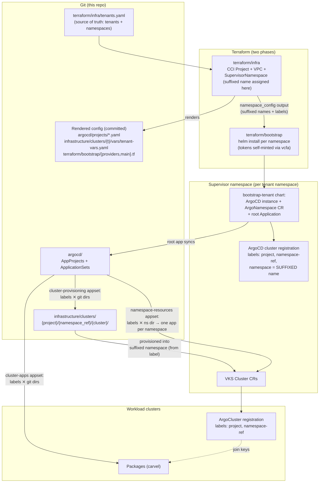
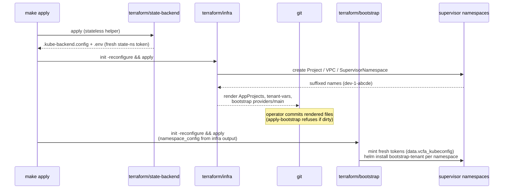
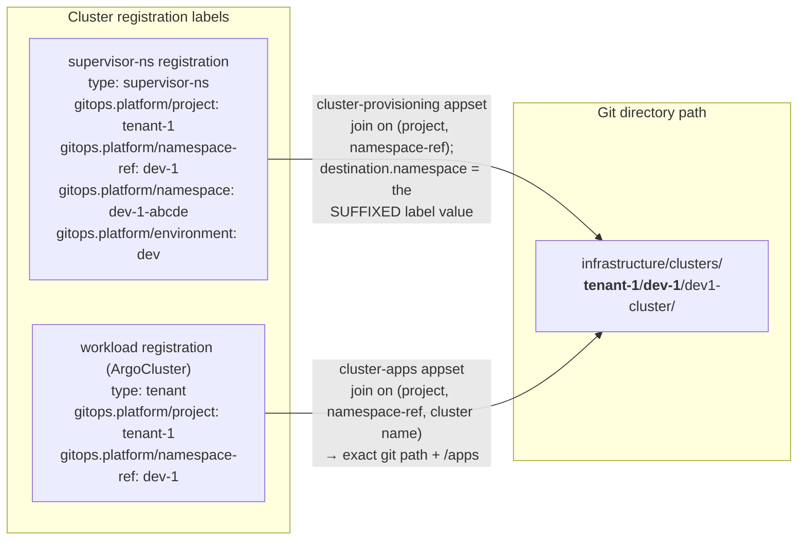
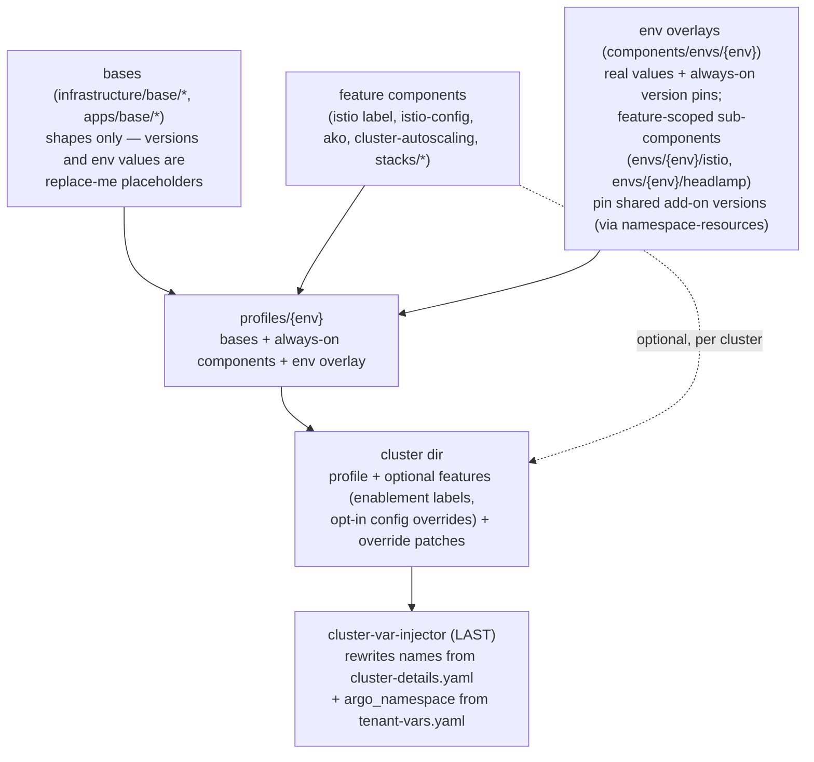
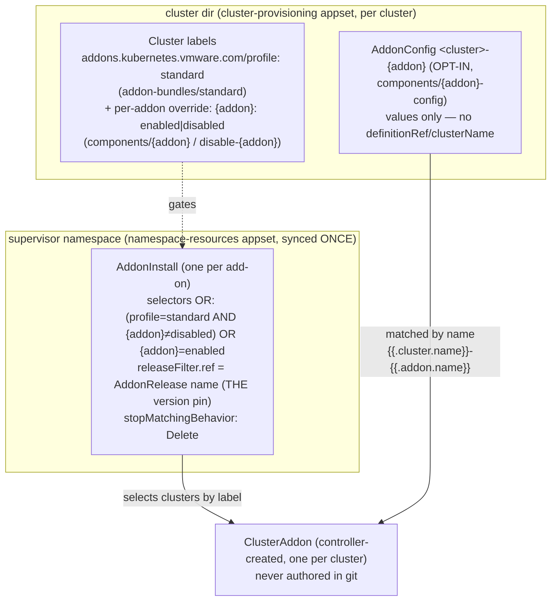
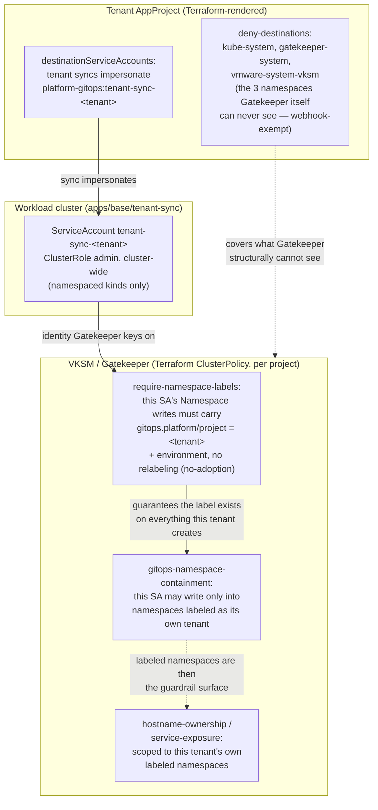

# Architecture

This repo is a reference architecture for automating a multi-tenant Kubernetes
fleet on **VMware Cloud Foundation**: **Terraform** provisions the foundations
(tenants, networks, namespaces, the GitOps control plane itself), and
**ArgoCD** manages everything that runs on them, from git. This document explains *why* it is shaped the
way it is. For operating instructions, see the [README](../README.md); for each
major design decision explained as *problem → choice → trade-off*, see
[DECISIONS.md](DECISIONS.md).

## Vocabulary

Terms this document assumes, in one place:

| Term | Meaning |
|------|---------|
| **vcfa** | VCF Automation — VCF's tenant-facing API/portal. Also the name of its Terraform provider. |
| **Supervisor namespace** | A vSphere namespace on the supervisor cluster: the unit of tenancy where quotas apply, VKS clusters are created, and (here) an ArgoCD instance runs. |
| **VKS cluster** | A workload Kubernetes cluster (vSphere Kubernetes Service), declared as a Cluster API `Cluster` resource inside a supervisor namespace. |
| **CCI Project** | The vcfa grouping a tenant's supervisor namespaces live under (`Project` custom resource). One per tenant here. |
| **ApplicationSet** | An ArgoCD controller that generates one ArgoCD `Application` per match from generators — here, a cluster-registration list joined with git directories. |
| **`ArgoNamespace` / `ArgoCluster`** | vSphere-ArgoCD-operator custom resources that register a supervisor namespace / workload cluster with an ArgoCD instance, carrying the labels this design joins on. |
| **AKO** | Avi Kubernetes Operator — the load-balancer integration installed on workload clusters (this repo's lab uses Avi; see *Pattern vs lab*). |

## The problem that shapes everything

VCF Automation (vcfa) generates supervisor-namespace names **at apply time**:
you ask for `dev-1`, you get `dev-1-abcde`. GitOps wants the desired state —
including deployment targets — declared in git *ahead* of time. Those two facts
conflict: git can never know the real name of the namespace a cluster should be
provisioned into.

Every non-obvious choice in this repo flows from resolving that conflict one
way: **generated identity never lives in git**. Git declares *logical* identity
(`tenant-1` / `dev-1` / `dev1-cluster`); the generated *physical* identity
(`dev-1-abcde`) is captured at install time as labels on the ArgoCD cluster
registration, and ApplicationSets join the two at sync time.

## System overview



Two lifecycles, two tools, one contract each:

- **Tenant lifecycle (Terraform):** `tenants.yaml` → supervisor namespaces,
  quotas, VPCs, the per-namespace ArgoCD bootstrap. Everything ArgoCD later
  needs from this phase crosses over in exactly two places (next section).
- **Cluster/app lifecycle (GitOps):** hand-authored cluster directories are
  discovered by ApplicationSets via the label join. No Terraform involvement.

## The two-phase Terraform design

Terraform is split into two separate configurations ("roots"), run in order
(`make apply` = `apply-infra` → `apply-bootstrap`), because the second phase's
*provider connections* depend on resources the first phase creates: you cannot configure a helm provider for a namespace
that does not exist yet, and Terraform cannot `for_each` provider blocks. The
infra run therefore **renders** the bootstrap run's `providers.tf` / `main.tf`
(one helm provider + module per namespace) as generated, committed files.



The infra → bootstrap handoff is exactly two contracts:

1. **`namespace_config` output** (structural, passed by the Makefile): the
   suffixed namespace names and the computed `gitops.platform/*` label set.
   Bootstrap never re-parses `tenants.yaml` and never guesses suffixed names.
2. **Committed rendered files** (`terraform/bootstrap/{providers,main}.tf`):
   pure wiring keyed by namespace — no values baked in, so they only change
   when the *set* of namespaces changes. Values live in hand-authored
   `locals.tf`; secrets are merged there from `TF_VAR_*`.

Supporting choices:

- **State backend:** Terraform state is a Kubernetes Secret in a dedicated
  supervisor namespace (`terraform/state-namespace/`), so CI runs on ephemeral
  runners with no external cloud dependency. The chicken-egg (the backend needs
  credentials before any root can run) is solved by a **stateless helper**
  (`terraform/state-backend/`) that re-reads a fresh namespace-scoped
  kubeconfig on every run — vcfa tokens are short-lived, so nothing that
  authenticates is ever cached or committed.
- **Token freshness:** for the same reason, the bootstrap root mints its own
  per-namespace tokens (`terraform/bootstrap/vcfa.tf`) at plan/apply time
  instead of consuming tokens captured in infra state.

## The decision model (label join)

The suffixed-name problem is solved by a small set of labels stamped on every
ArgoCD cluster registration, joined against the git directory layout:



How each label gets there:

| Label | Computed in | Attached by |
|-------|-------------|-------------|
| `gitops.platform/project`, `namespace-ref`, `environment`, `type: supervisor-ns` | `terraform/infra/main.tf` (from `tenants.yaml`) | `bootstrap-tenant` chart → `ArgoNamespace` CR |
| `gitops.platform/namespace` (the **suffixed** name) | the chart itself, from `.Release.Namespace` at install time | same |
| workload `type: tenant`, `project`, `namespace-ref` | kustomize (`argocd-tenant-cluster` component + `cluster-var-injector`) | `ArgoCluster` CR synced with the cluster |

The `cluster-provisioning` ApplicationSet pairs each supervisor-namespace
registration with the git directories under
`infrastructure/clusters/{project}/{namespace_ref}/*/` — and because that
search path is built **from the registration's own label values**, each
namespace finds exactly its own cluster directories, nothing else. The
deployment target (`destination.namespace`) comes from the
`gitops.platform/namespace` label, so the suffixed name flows
vcfa → chart → label → ApplicationSet without ever touching git.
`cluster-apps` does the same join plus the cluster name, landing on the exact
`{cluster}/apps` path.

Rules the join depends on — every one actively checked, none left implicit:

- `(project, namespace_ref)` is unique — Terraform precondition + the directory layout itself
- cluster names are unique per `(project, namespace_ref)` — guaranteed by the directory layout (cluster names may repeat across tenants/namespaces; the appset Application names are path-scoped)
- `cluster-details.yaml` values match the directory path — `scripts/validate.sh`

## Kustomize layering

Cluster definitions resolve through plain kustomize — `kustomize build
<cluster-dir>` reproduces byte-for-byte what ArgoCD deploys, with no sync-time
templating:



Key properties:

- **Placeholders fail loudly.** Bases carry `replace-me` where an environment
  or a version decision belongs; `scripts/validate.sh` rejects any rendered
  output still containing one. A cluster cannot silently deploy a default.
- **Versions roll per environment** (see the README's *Version management*
  table): always-on pins in `envs/{env}`, optional-feature pins in
  feature-scoped sub-components the cluster includes alongside the feature,
  per-cluster canary via a `patches:` block. A version bump is a one-line PR
  against one environment.
- **Two injectors, not one.** The apps tree cannot read the cluster's
  `../cluster-details.yaml` (kustomize forbids *files* outside the
  kustomization root, though *directories* are fine), so it has its own smaller
  injector fed by a per-cluster `vars` configMapGenerator — with `validate.sh`
  cross-checking the duplicated cluster name against the directory.

### Why `profiles/{env}` and `components/envs/{env}` are separate

They look redundant — both are per-environment, and today there is exactly one
of each. They split on axis, not on scope:

| | `profiles/{env}` | `components/envs/{env}` |
|---|---|---|
| kind | `Kustomization` | `Component` |
| holds | `resources:` (bases) + `components:` (which features) | `patches:` only |
| answers | **which pieces** | **what values** (real env values + version pins) |
| included as | a `resources:` entry, by cluster roots | a `components:` entry |

The `components/envs/{env}/` directory can't collapse into the profile
regardless of that: its feature-scoped sub-components (`envs/dev/istio`,
`/headlamp`, `/external-secrets`) are pulled by **namespace-resources** roots,
which never reference `profiles/` at all. Two disjoint consumer trees share
that directory.

The *top-level* `components/envs/{env}` is the part that is 1:1 with the
profile — one consumer, and it's the last component, so its patches would
render identically inlined as a `patches:` block on the profile. Left as its
own component on purpose: inlining would put cluster-class/Kubernetes/AKO pins
in `profiles/{env}` while add-on pins stay in `components/envs/{env}/*`,
splitting version pins across two trees and breaking the single rule that makes
version rolls a one-line PR (*"all env pins live under
`components/envs/{env}`"*). The 1:1 is also an artifact of one env with one
profile, not a structural property — a second profile in the same environment
would share the same env overlay.

## VKS add-on pattern

All add-ons follow one pattern built on the VKS addon CRDs
(`addons.kubernetes.vmware.com/v1alpha1`): **AddonInstall does label-based
deployment, AddonConfig is per-cluster overrides only.** (Rationale:
`docs/DECISIONS.md` #9; the step-by-step recipe: `CLAUDE.md` → "VKS add-ons".)



### Add-on profiles (which clusters get which add-ons)

Enablement is a cluster label, but the label a cluster normally carries is a
**bundle** name, not one key per add-on: `addons.kubernetes.vmware.com/profile:
standard`, added by `components/addon-bundles/{bundle}` and inherited through
`profiles/{env}`. Every add-on in the bundle selects on it, so adding an add-on
to the default set is one edit in that add-on's own base — not one label patch
per environment. Bundle membership is a property of the add-on, not of the env
layer, which leaves `components/envs/{env}` holding versions only.

Per-add-on labels remain, as the override. They cannot be a second selector:
`spec.clusters` is a list and its entries **OR**, so an extra selector could
only ever add clusters, never remove them. The override lives *inside* the
profile selector, where `matchExpressions` AND together:

```yaml
clusters:
- selector:            # profile grants it, unless explicitly disabled
    matchExpressions:
    - {key: addons.kubernetes.vmware.com/profile, operator: In,    values: ["standard"]}
    - {key: addons.kubernetes.vmware.com/istio,   operator: NotIn, values: ["disabled"]}
- selector:            # explicit opt-in, no profile required
    matchExpressions:
    - {key: addons.kubernetes.vmware.com/istio,   operator: In,    values: ["enabled"]}
```

`NotIn` also matches a cluster that lacks the key, so a profile-only cluster
installs. This is the vendor's own opt-out idiom (see the `cluster-autoscaler`
example in `kubectl explain addoninstall.spec.clusters`).

Two add-ons sit outside the bundle deliberately. **headlamp** is dev-only, so
its gate stays an `envs/dev` label — an env-scoped add-on, not a bundle member.
**Observability** is in the bundle, but its `AddonInstall` is built-in and not
ours to edit, so `addon-bundles/standard` sets that add-on's *native*
`automated-monitoring` label instead. That is the general rule: profile label
for add-ons we author, native label for platform-installed ones. Consequence:
a cluster with no profile component gets no observability —
`components/enable-observability` is the escape hatch.

Two variants:

- **Installable add-on (istio, headlamp).** ONE shared `AddonInstall` per
  supervisor namespace (`base/{addon}`, delivered by the `namespace-resources`
  ApplicationSet — one owner even when clusters share the namespace), selecting
  clusters on the enablement label with `stopMatchingBehavior: Delete` (flip
  the label → clean uninstall). The version is pinned in exactly one place:
  `releaseFilter.ref.name`, an `AddonRelease` name, patched by
  `components/envs/{env}/{addon}`. The API has **no `AddonInstall.spec.version`
  field** — a value set there is pruned by the API server and the add-on
  silently floats to the latest release (verified live).
- **Auto-installed core add-on (ako, antrea).** The platform's BUILT-IN
  AddonInstalls (in `vmware-system-vks-public`, `Delete`) install these —
  nothing to author but the per-cluster `AddonConfig`. AKO's gate is the
  platform-added `ako.kubernetes.vmware.com/install: "true"` cluster label
  (`disable-ako` flips it); prometheus/telegraf gate on
  `automated-monitoring: enabled` (`disable-observability` /
  `enable-observability`). Antrea is different again: it's the cluster's CNI,
  selected in the **Cluster spec itself** (`spec.topology.variables` →
  `bootstrapAddons.cniRef: antrea`, defaulted by the cluster class) and
  installed by the built-in `builtin-core-cni-antrea` AddonInstall — no label
  gate, no version pin (bundled with the cluster class); its settings are still
  tuned through the per-cluster `AddonConfig` (`base/antrea`). Every cluster
  declares its CNI explicitly — exactly ONE `cni-*` component
  (`cni-antrea` | `cni-cilium` | `cni-calico`) sets `bootstrapAddons.cniRef`;
  `cni-antrea` (the platform default made explicit) also owns the antrea
  `AddonConfig`, with `antrea-nsx` as a settings-only patch on top. The CNI is
  never in the profile. Day-0 only: the cluster class rejects any change to
  `bootstrapAddons` after creation (k8s 1.35+).
- **Installable add-on from a custom helm repo (external-secrets).** Same
  shape as istio/headlamp, with one prerequisite: the platform catalog has no
  entry for it, so a hand-authored `supervisor-addons/{addon}.yaml` registers
  the helm repo as an `AddonRepository` + `AddonRepositoryInstall` in
  `vmware-system-vks-public` — a genuine Supervisor-scope namespace this
  repo's Terraform (`kubernetes.vcfa-org`, read-only there) and GitOps
  (per-tenant namespace only) cannot reach, so it's applied manually with
  `kubectl` by a human holding Supervisor-admin access, never Terraform,
  never ArgoCD (`docs/DECISIONS.md` #14). Once registered, `addonRef.name`
  is the chart name and `releaseFilter.ref.name` is `"<chart>.<version>"` —
  registration does mint an `AddonRelease`, just under a shorter name than a
  vendor-packaged add-on. Two constraints make this variant unlike the others:
  the add-on needs **helm-controller** on the cluster (a **3.7+ cluster
  class**, which is what makes the platform install it), and registration is
  **Supervisor-wide** — it fans out to every cluster on the Supervisor,
  including other tenants', with no way to scope it. See CLAUDE.md "Adding a
  custom helm addon".

`AddonConfig` is always opt-in, per-cluster overrides only: the addon
controller auto-generates one named `{cluster}-{addon}` (its default
`addonConfigNameTemplate`) for clusters that ship none, and fills
`addonConfigDefinitionRef` + `clusterName` on authored ones — so authored
configs (`base/istio-config`, injector-prefixed to `<cluster>-{addon}`) carry
values only, and a cluster on defaults ships nothing at all. Every addon
resource is labeled `app.kubernetes.io/name: {addon}` and every kustomize patch
targets by `labelSelector`, never exact name.

| Add-on | Variant | Enablement label | Version pin |
|--------|---------|------------------|-------------|
| headlamp | installable, default-on (dev) | `addons.kubernetes.vmware.com/headlamp` (envs/dev; `disable-headlamp`) — env-scoped, not in a profile | `envs/{env}/headlamp` → releaseFilter |
| istio | installable, `standard` bundle | `.../profile: standard` (`addon-bundles/standard`); override `.../istio` (`components/istio` / `disable-istio`) | `envs/{env}/istio` → releaseFilter |
| external-secrets | installable (custom helm repo), `standard` bundle | `.../profile: standard`; override `.../external-secrets` (`disable-external-secrets`) | `envs/{env}/external-secrets` → releaseFilter (`chart.version`) |
| ako | auto-installed | `ako.kubernetes.vmware.com/install` (platform-added; `disable-ako`) | `envs/{env}` → AddonConfig `addonConfigDefinitionRef` |
| CNI (antrea \| cilium \| calico) | auto-installed (cluster's CNI) | — (Cluster spec: `bootstrapAddons.cniRef`, set day-0 by exactly one `cni-*` component per cluster) | — (bundled with cluster class) |
| observability | auto-installed (prometheus/telegraf) | `addons.kubernetes.vmware.com/automated-monitoring` — set by `addon-bundles/standard` (built-in AddonInstall, so its native label, not the bundle one); `disable-`/`enable-observability` | — (managed by VKS) |

## Cluster policy + namespace self-service

Tenants create and manage namespaces **through git only** — their Applications
sync namespace manifests + workloads into their VKS clusters via the shared
ArgoCD instance. The problem: the workload cluster's registration identity
(`argo-attach-sa`, bound to `cluster-admin` — `vmware-system-auth-sync-argo-attach-sa`)
is shared by every sync, tenant and platform alike, so nothing at the cluster
API server can tell a tenant's own gitops flow apart from the platform's. Left
alone, "self-service namespaces" means "tenant is cluster-admin."

The fix layers three mechanisms, each holding a line the others structurally
can't:



| Layer | Mechanism | Holds |
|-------|-----------|-------|
| AppProject | `sourceRepos`, `clusterResourceWhitelist: Namespace` only, `destinationServiceAccounts` (per-tenant impersonation), deny-destinations for the 3 webhook-exempt namespaces | Splits tenant identity from platform identity; no cluster-scoped kinds; covers the one seam Gatekeeper can't reach |
| Per-tenant SA + RBAC (`apps/base/tenant-sync`) | `ClusterRole: admin` bound cluster-wide (namespaced kinds only) | No cluster-scoped writes even if the AppProject were misconfigured |
| Gatekeeper (VCF Automation `ClusterPolicy`) | The 4 policies below, keyed on the impersonated identity | Label-aware namespace ownership |
| VKSM built-ins | Pod-security policies (shipped by the platform) | Escape-to-node from inside a tenant's own namespace |

**Why per-tenant identity, not one shared `tenant-sync` SA.** The generated
tenant AppProject's `destinations` block allows targeting *any* registered
workload cluster by name — it does not isolate tenants from each other's
clusters (see the block's own comment). If every tenant impersonated the same
literal principal, a tenant landing on another tenant's cluster via that gap
would be indistinguishable, at admission, from that cluster's own legitimate
gitops flow. Naming the SA per tenant (`tenant-sync-<tenant>`, injected by
`apps/components/cluster-var-injector` from this cluster's own `project`
value) means that SA doesn't exist at all on a cluster it isn't native to —
the sync fails outright rather than silently succeeding under a trusted
identity.

**The four policies** (catalog: `terraform/infra/policies.tf`; see CLAUDE.md
→ "Adding a policy" to extend it):

| Policy | Rule | Selector |
|--------|------|----------|
| `require-namespace-labels` | The tenant's own sync identity must set `gitops.platform/project`/`environment` on any Namespace it creates or updates; no-adoption blocks relabeling a namespace that didn't already carry this tenant's value | none (`Namespace` is cluster-scoped) |
| `gitops-namespace-containment` | The tenant's own sync identity may write only into namespaces labeled as its own project | `gitops.platform/project NotIn [tenant]` (also matches unlabeled namespaces — no exclude-list) |
| `hostname-ownership` | `Ingress` / `Gateway` (Gateway API and istio) / `HTTPRoute` hosts must fall under an allowed DNS suffix | `gitops.platform/project In [tenant]` |
| `service-exposure` | Deny `NodePort`, steering exposure to a Gateway-backed LoadBalancer. `LoadBalancer` Services are **allowed** — a tenant exposes via its own `Gateway` (any GatewayClass: `avi-lb`, `istio`, or customer-brought), which the provider realizes as an LB Service. Not policed by controller identity (would couple the policy to one provider and miss customer-brought ones); LB sprawl is bounded by the cluster's Avi SEG / VPC IP pool instead | `gitops.platform/project In [tenant]` |

All four ship in `dryrun`; see `tenants.yaml` → a tenant's `policies:` block
and CLAUDE.md's rollout order before flipping to `deny`.

**Enabling impersonation.** ArgoCD sync impersonation
(`application.sync.impersonation.enabled`) is set via a *minimal* `ConfigMap`
patch (`argocd/config/argocd-cm-patch.yaml`) applied with Server-Side Apply —
it owns only that one key in `argocd-cm`, coexisting with the
argocd-service operator's own manager rather than replacing the whole
ConfigMap. This depends on the operator granting **per-key**, not
whole-object, field ownership — verified against the live instance before
relying on it (see `docs/GETTING-STARTED.md`).

The flag is global — it also requires `destinationServiceAccounts` on the
platform's own `default` and `infra` AppProjects (restoring their existing
`argo-attach-sa` identity, not granting anything new); see
`docs/DECISIONS.md` #12 for why and why the value shape differs between them.

**Facts this design leans on, verified live** (not assumed): the Gatekeeper
webhook backing VKSM auto-exempts only `gatekeeper-system` / `kube-system` /
`vmware-system-vksm` — no `vmware-system-*` wildcard — so every other platform
namespace is genuinely in scope for `gitops-namespace-containment` and needs
no separate exclusion; the platform's own load-balanced Services live in
`istio-ingress` and `headlamp` (not `istio-system`); VKSM ships its own
pod-security policies already, so this catalog doesn't duplicate them.

## Pattern vs lab: the seams

Not everything in this repo is the reference. The table below marks the seams —
what to keep, what to swap for your environment.

**The pattern (keep these — they survive any swap):**

- The two-phase Terraform design and its two handoff contracts
- The label-join decision model (suffixed names never in git)
- Committed rendered files with the `check-generated-clean` gate
- The profile / env-overlay / feature-component / injector layering and the
  `replace-me` + `validate.sh` guardrails
- The add-on model: shared label-gated `AddonInstall` per namespace,
  releaseFilter version pins, opt-in per-cluster `AddonConfig`
- The stateless-helper approach to short-lived vcfa credentials

**The lab (swap these for your environment):**

| Layer | In this repo | Where to swap | Notes |
|-------|--------------|---------------|-------|
| Load balancer | AVI (AKO addon on every cluster) | `avi_enabled` + `seg_name` (Service Engine Group, per region, `terraform/infra/variables.tf`); drop `components/ako*` from profiles/clusters | `avi_enabled=false` already switches the VPC to an NSX `LoadBalancer` CR. `seg_name` is required when `avi_enabled=true`, null otherwise. On VCF 9.1 AKO is auto-installed into VKS clusters (the built-in `ako-global-installer` selects the platform-added `ako.kubernetes.vmware.com/install: "true"` cluster label — flip it per cluster with `components/disable-ako`), so there's no AKO secret to bootstrap; the `AddonConfig`/injector wiring is AVI-specific. |
| CNI choice + tuning | Explicit per cluster: exactly one `cni-*` component (`cni-antrea` \| `cni-cilium` \| `cni-calico`); antrea + NSX adds `antrea-nsx` after `cni-antrea` | Cluster component list (day-0; never the profile) | The CNI is selected in the Cluster spec (`bootstrapAddons.cniRef`; immutable after creation, k8s 1.35+). `cni-antrea` owns the antrea `AddonConfig`; NSX integration is a settings-only patch on it (`antreaNSX.enable: true`); no addon version to pin, unlike AKO. |
| App baseline | carvel package installer + cert-manager | `apps/components/stacks/*`, `apps/profiles/{env}` | Stacks are plain kustomize components — swap contents freely; the env-pinning pattern is what matters. (Observability is no longer an app stack; VKS 9.1+ delivers it via the `automated-monitoring` addon label, set by the `standard` add-on bundle — opt a cluster out with `infrastructure/components/disable-observability`, back in with `enable-observability`.) |
| Installable add-ons (label-gated) | headlamp + istio + external-secrets (`base/{addon}` → one shared `AddonInstall` per namespace); bundle `addon-bundles/standard` = istio + external-secrets + observability | `infrastructure/clusters/{project}/{namespace_ref}/namespace-resources/`, version in `components/envs/{env}/{addon}` (`releaseFilter.ref` = an `AddonRelease` name), membership in `components/addon-bundles/{bundle}` (headlamp is the env-scoped exception, `components/envs/dev`) | The pattern: a single label-selected `AddonInstall` per supervisor namespace (delivered by the `namespace-resources` appset, not per cluster) installs the add-on on any cluster in the bundle (`addons.kubernetes.vmware.com/profile`) that hasn't opted out with the per-add-on label; `stopMatchingBehavior: Delete` uninstalls when the label flips. Per-cluster value overrides are a separate OPT-IN `AddonConfig` (`components/istio-config`) — clusters without one run the addon defaults (the controller generates the AddonConfig). Auto-installed core addons (ako, antrea) have no `AddonInstall` to author — they're `AddonConfig`-only. |
| Package source & images | Broadcom standard package repo, ubuntu content library | `apps/components/envs/{env}` (bundle image), `infrastructure/components/envs/{env}` (os-image annotations) | Deliberately env-layer values, never in bases. |
| Sizing & placement | `z-wld-a` zone, vSAN storage policy, class sizes | Defaults in `terraform/modules/tenant/variables.tf`; per-namespace overrides in `tenants.yaml` | Zone names vary per region — always set explicitly. |
| GitOps repo identity | `github.com/warroyo/argocd-scaffolding` | `argocd/repo-config.yaml` — the single source; Terraform and the ApplicationSets both read it | One-file fork. |
| ArgoCD flavor | vSphere ArgoCD operator CR (`argocd-service.vsphere.vmware.com`) | `charts/bootstrap-tenant/templates/argocd-instance.yaml` | The chart's other resources (ArgoNamespace, root app) are the pattern; the instance CR is the VCF-specific part. |
| Cluster policy values | Lab DNS suffix `.will-org-apps.vcf.lab` (hostname-ownership) | Per-tenant `policies:` → `parameters` in `tenants.yaml` | The policy *catalog* (`terraform/infra/policies.tf`, the Rego) is the pattern; the suffix is just the value a real tenant would set to their own domain. |

## Known limitations

Tracked with priorities and detail in [BACKLOG.md](BACKLOG.md). The headline
items an adopter should know before production: deletion is unguarded
(deleting — or renaming — a cluster directory deletes the live cluster; a
rename is a delete+recreate), a single shared ArgoCD admin credential (no
SSO/RBAC yet — the cluster-policy layer constrains what a tenant's *gitops
flow* can do, not who can push to their repo),
Terraform state lives on the platform it manages (back it up off-platform), and
one region per install. On the cluster-policy layer specifically: ArgoCD sync
impersonation is a beta feature (v3.0.19, this repo's shipped version); the
tenant AppProject's cross-cluster destination gap (above) is mitigated, not
closed — a tenant landing on another tenant's cluster still fails to sync
rather than being isolated by a positive check; and whether ArgoCD hard-fails
or silently falls back to the un-impersonated identity when the configured
service account is momentarily missing (e.g. a brand-new cluster) is a
verify-live item, not yet confirmed (`docs/GETTING-STARTED.md`).
