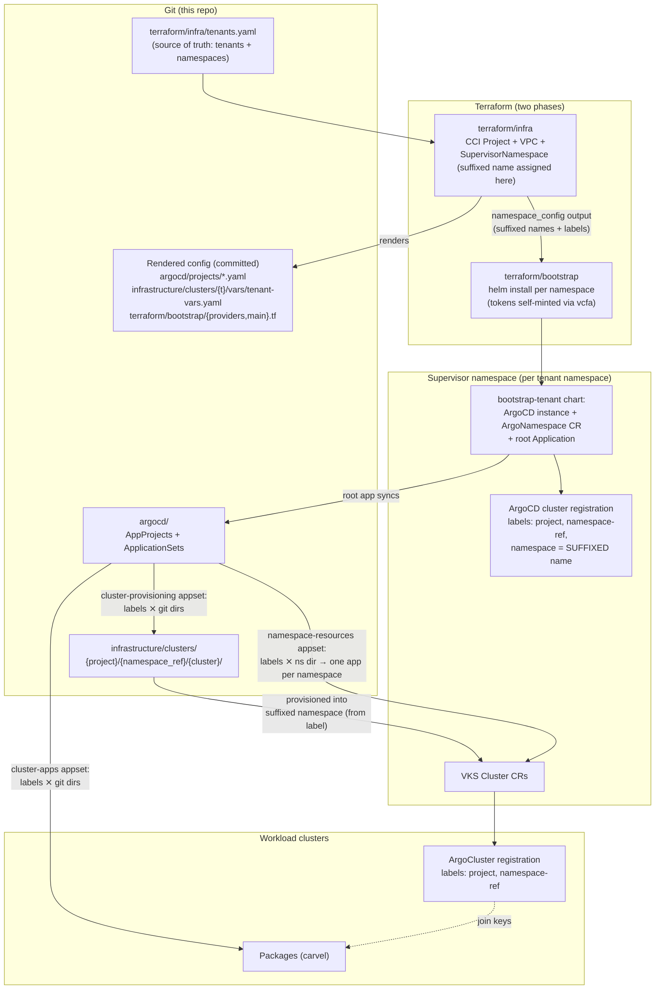
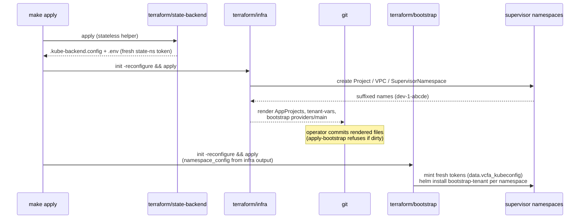
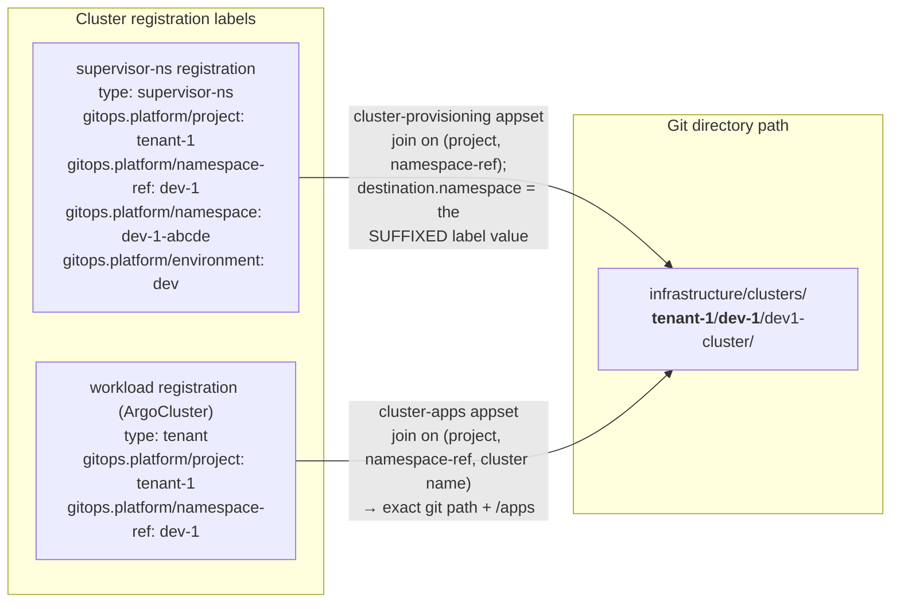
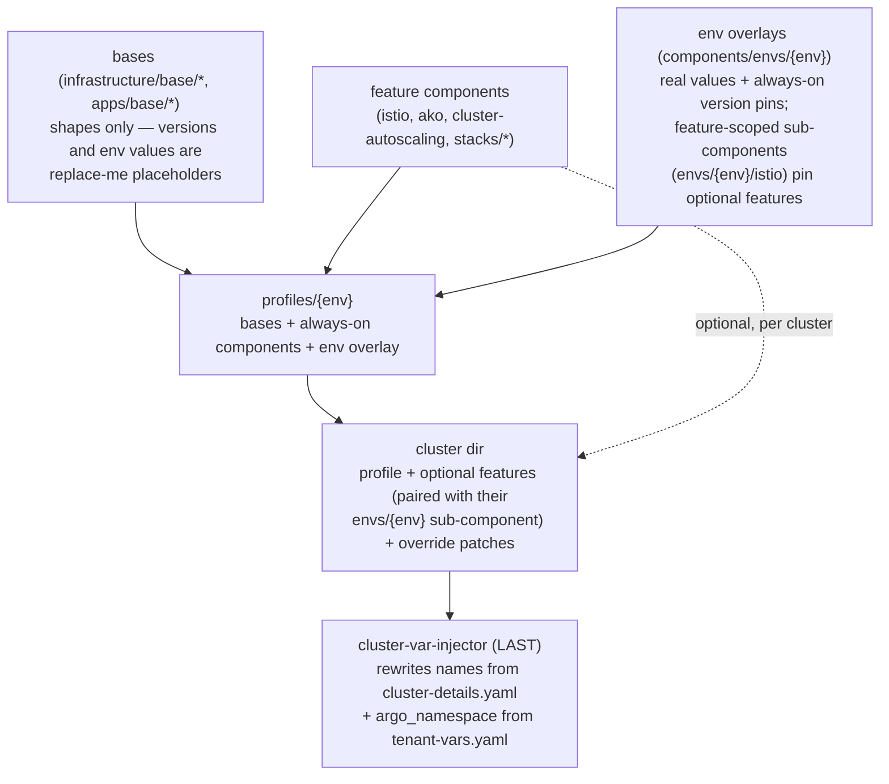

# Architecture

This repo is a reference architecture for automating a multi-tenant Kubernetes
fleet on **VMware Cloud Foundation**: **Terraform** provisions the foundations
(tenants, networks, namespaces, the GitOps control plane itself), and
**ArgoCD** manages everything that runs on them, from git. This document explains *why* it is shaped the
way it is. For operating instructions, see the [README](../README.md); for each
major design decision explained as *problem → choice → trade-off*, see
[DECISIONS.md](DECISIONS.md).

## Vocabulary

Terms this document assumes, in one place:

| Term | Meaning |
|------|---------|
| **vcfa** | VCF Automation — VCF's tenant-facing API/portal. Also the name of its Terraform provider. |
| **Supervisor namespace** | A vSphere namespace on the supervisor cluster: the unit of tenancy where quotas apply, VKS clusters are created, and (here) an ArgoCD instance runs. |
| **VKS cluster** | A workload Kubernetes cluster (vSphere Kubernetes Service), declared as a Cluster API `Cluster` resource inside a supervisor namespace. |
| **CCI Project** | The vcfa grouping a tenant's supervisor namespaces live under (`Project` custom resource). One per tenant here. |
| **ApplicationSet** | An ArgoCD controller that generates one ArgoCD `Application` per match from generators — here, a cluster-registration list joined with git directories. |
| **`ArgoNamespace` / `ArgoCluster`** | vSphere-ArgoCD-operator custom resources that register a supervisor namespace / workload cluster with an ArgoCD instance, carrying the labels this design joins on. |
| **AKO** | Avi Kubernetes Operator — the load-balancer integration installed on workload clusters (this repo's lab uses Avi; see *Pattern vs lab*). |

## The problem that shapes everything

VCF Automation (vcfa) generates supervisor-namespace names **at apply time**:
you ask for `dev-1`, you get `dev-1-abcde`. GitOps wants the desired state —
including deployment targets — declared in git *ahead* of time. Those two facts
conflict: git can never know the real name of the namespace a cluster should be
provisioned into.

Every non-obvious choice in this repo flows from resolving that conflict one
way: **generated identity never lives in git**. Git declares *logical* identity
(`tenant-1` / `dev-1` / `dev1-cluster`); the generated *physical* identity
(`dev-1-abcde`) is captured at install time as labels on the ArgoCD cluster
registration, and ApplicationSets join the two at sync time.

## System overview

Two lifecycles, two tools, one contract each:

- **Tenant lifecycle (Terraform):** `tenants.yaml` → supervisor namespaces,
  quotas, VPCs, the per-namespace ArgoCD bootstrap. Everything ArgoCD later
  needs from this phase crosses over in exactly two places (next section).
- **Cluster/app lifecycle (GitOps):** hand-authored cluster directories are
  discovered by ApplicationSets via the label join. No Terraform involvement.

## The two-phase Terraform design

Terraform is split into two separate configurations ("roots"), run in order
(`make apply` = `apply-infra` → `apply-bootstrap`), because the second phase's
*provider connections* depend on resources the first phase creates: you cannot configure a helm provider for a namespace
that does not exist yet, and Terraform cannot `for_each` provider blocks. The
infra run therefore **renders** the bootstrap run's `providers.tf` / `main.tf`
(one helm provider + module per namespace) as generated, committed files.

The infra → bootstrap handoff is exactly two contracts:

1. **`namespace_config` output** (structural, passed by the Makefile): the
   suffixed namespace names and the computed `gitops.platform/*` label set.
   Bootstrap never re-parses `tenants.yaml` and never guesses suffixed names.
2. **Committed rendered files** (`terraform/bootstrap/{providers,main}.tf`):
   pure wiring keyed by namespace — no values baked in, so they only change
   when the *set* of namespaces changes. Values live in hand-authored
   `locals.tf`; secrets are merged there from `TF_VAR_*`.

Supporting choices:

- **State backend:** Terraform state is a Kubernetes Secret in a dedicated
  supervisor namespace (`terraform/state-namespace/`), so CI runs on ephemeral
  runners with no external cloud dependency. The chicken-egg (the backend needs
  credentials before any root can run) is solved by a **stateless helper**
  (`terraform/state-backend/`) that re-reads a fresh namespace-scoped
  kubeconfig on every run — vcfa tokens are short-lived, so nothing that
  authenticates is ever cached or committed.
- **Token freshness:** for the same reason, the bootstrap root mints its own
  per-namespace tokens (`terraform/bootstrap/vcfa.tf`) at plan/apply time
  instead of consuming tokens captured in infra state.

## The decision model (label join)

The suffixed-name problem is solved by a small set of labels stamped on every
ArgoCD cluster registration, joined against the git directory layout:

How each label gets there:

| Label | Computed in | Attached by |
|-------|-------------|-------------|
| `gitops.platform/project`, `namespace-ref`, `environment`, `type: supervisor-ns` | `terraform/infra/main.tf` (from `tenants.yaml`) | `bootstrap-tenant` chart → `ArgoNamespace` CR |
| `gitops.platform/namespace` (the **suffixed** name) | the chart itself, from `.Release.Namespace` at install time | same |
| workload `type: tenant`, `project`, `namespace-ref` | kustomize (`argocd-tenant-cluster` component + `cluster-var-injector`) | `ArgoCluster` CR synced with the cluster |

The `cluster-provisioning` ApplicationSet pairs each supervisor-namespace
registration with the git directories under
`infrastructure/clusters/{project}/{namespace_ref}/*/` — and because that
search path is built **from the registration's own label values**, each
namespace finds exactly its own cluster directories, nothing else. The
deployment target (`destination.namespace`) comes from the
`gitops.platform/namespace` label, so the suffixed name flows
vcfa → chart → label → ApplicationSet without ever touching git.
`cluster-apps` does the same join plus the cluster name, landing on the exact
`{cluster}/apps` path.

Rules the join depends on — every one actively checked, none left implicit:

- `(project, namespace_ref)` is unique — Terraform precondition + the directory layout itself
- cluster names are unique per `(project, namespace_ref)` — guaranteed by the directory layout (cluster names may repeat across tenants/namespaces; the appset Application names are path-scoped)
- `cluster-details.yaml` values match the directory path — `scripts/validate.sh`

## Kustomize layering

Cluster definitions resolve through plain kustomize — `kustomize build
<cluster-dir>` reproduces byte-for-byte what ArgoCD deploys, with no sync-time
templating:

Key properties:

- **Placeholders fail loudly.** Bases carry `replace-me` where an environment
  or a version decision belongs; `scripts/validate.sh` rejects any rendered
  output still containing one. A cluster cannot silently deploy a default.
- **Versions roll per environment** (see the README's *Version management*
  table): always-on pins in `envs/{env}`, optional-feature pins in
  feature-scoped sub-components the cluster includes alongside the feature,
  per-cluster canary via a `patches:` block. A version bump is a one-line PR
  against one environment.
- **Two injectors, not one.** The apps tree cannot read the cluster's
  `../cluster-details.yaml` (kustomize forbids *files* outside the
  kustomization root, though *directories* are fine), so it has its own smaller
  injector fed by a per-cluster `vars` configMapGenerator — with `validate.sh`
  cross-checking the duplicated cluster name against the directory.

## Pattern vs lab: the seams

Not everything in this repo is the reference. The table below marks the seams —
what to keep, what to swap for your environment.

**The pattern (keep these — they survive any swap):**

- The two-phase Terraform design and its two handoff contracts
- The label-join decision model (suffixed names never in git)
- Committed rendered files with the `check-generated-clean` gate
- The profile / env-overlay / feature-component / injector layering and the
  `replace-me` + `validate.sh` guardrails
- The stateless-helper approach to short-lived vcfa credentials

**The lab (swap these for your environment):**

| Layer | In this repo | Where to swap | Notes |
|-------|--------------|---------------|-------|
| Load balancer | AVI (AKO addon on every cluster) | `avi_enabled` + `seg_name` (Service Engine Group, per region, `terraform/infra/variables.tf`); drop `components/ako*` from profiles/clusters | `avi_enabled=false` already switches the VPC to an NSX `LoadBalancer` CR. `seg_name` is required when `avi_enabled=true`, null otherwise. On VCF 9.1 AKO is auto-installed into VKS clusters, so there's no AKO secret to bootstrap; the `AddonConfig`/injector wiring is AVI-specific. |
| CNI tuning | Antrea + NSX integration (`components/antrea-nsx`) | Profile component list | VKS 3.6+ ships Antrea as a managed addon, so NSX integration is an `AddonConfig` (`base/antrea`, `antreaNSX.enable: true`) — no addon version to pin, unlike AKO. |
| App baseline | carvel package installer + cert-manager | `apps/components/stacks/*`, `apps/profiles/{env}` | Stacks are plain kustomize components — swap contents freely; the env-pinning pattern is what matters. (Observability is no longer an app stack; VKS 9.1+ delivers it by default via the `automated-monitoring` addon label on the base Cluster — opt a cluster out with `infrastructure/components/disable-observability`.) |
| Namespace add-ons (label-gated) | headlamp (`base/headlamp` → one shared `AddonInstall` per namespace) | `infrastructure/clusters/{project}/{namespace_ref}/namespace-resources/`, version in `components/envs/{env}/headlamp`, default-on label in `components/envs/dev`, opt-out `components/disable-headlamp` | The pattern: a single label-selected `AddonInstall` per supervisor namespace (delivered by the `namespace-resources` appset, not per cluster) installs the add-on on any cluster carrying the label — swap headlamp for any VKS add-on that needs no cluster-specific overrides. Add-ons that DO need per-cluster overrides use the per-cluster `AddonInstall`+`AddonConfig` pattern (istio). |
| Package source & images | Broadcom standard package repo, ubuntu content library | `apps/components/envs/{env}` (bundle image), `infrastructure/components/envs/{env}` (os-image annotations) | Deliberately env-layer values, never in bases. |
| Sizing & placement | `z-wld-a` zone, vSAN storage policy, class sizes | Defaults in `terraform/modules/tenant/variables.tf`; per-namespace overrides in `tenants.yaml` | Zone names vary per region — always set explicitly. |
| GitOps repo identity | `github.com/warroyo/argocd-scaffolding` | `argocd/repo-config.yaml` — the single source; Terraform and the ApplicationSets both read it | One-file fork. |
| ArgoCD flavor | vSphere ArgoCD operator CR (`argocd-service.vsphere.vmware.com`) | `charts/bootstrap-tenant/templates/argocd-instance.yaml` | The chart's other resources (ArgoNamespace, root app) are the pattern; the instance CR is the VCF-specific part. |

## Known limitations

Tracked with priorities and detail in [BACKLOG.md](BACKLOG.md). The headline
items an adopter should know before production: deletion is unguarded
(deleting — or renaming — a cluster directory deletes the live cluster; a
rename is a delete+recreate), a single shared ArgoCD admin credential (no
SSO/RBAC yet),
Terraform state lives on the platform it manages (back it up off-platform), and
one region per install.
